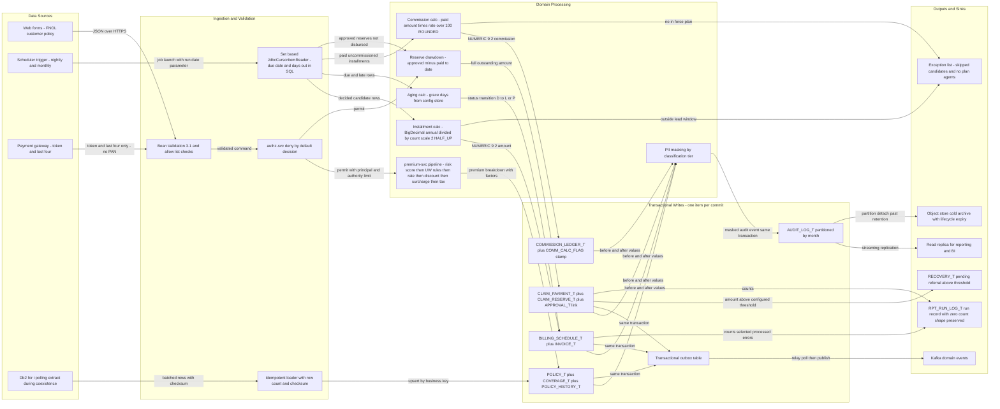
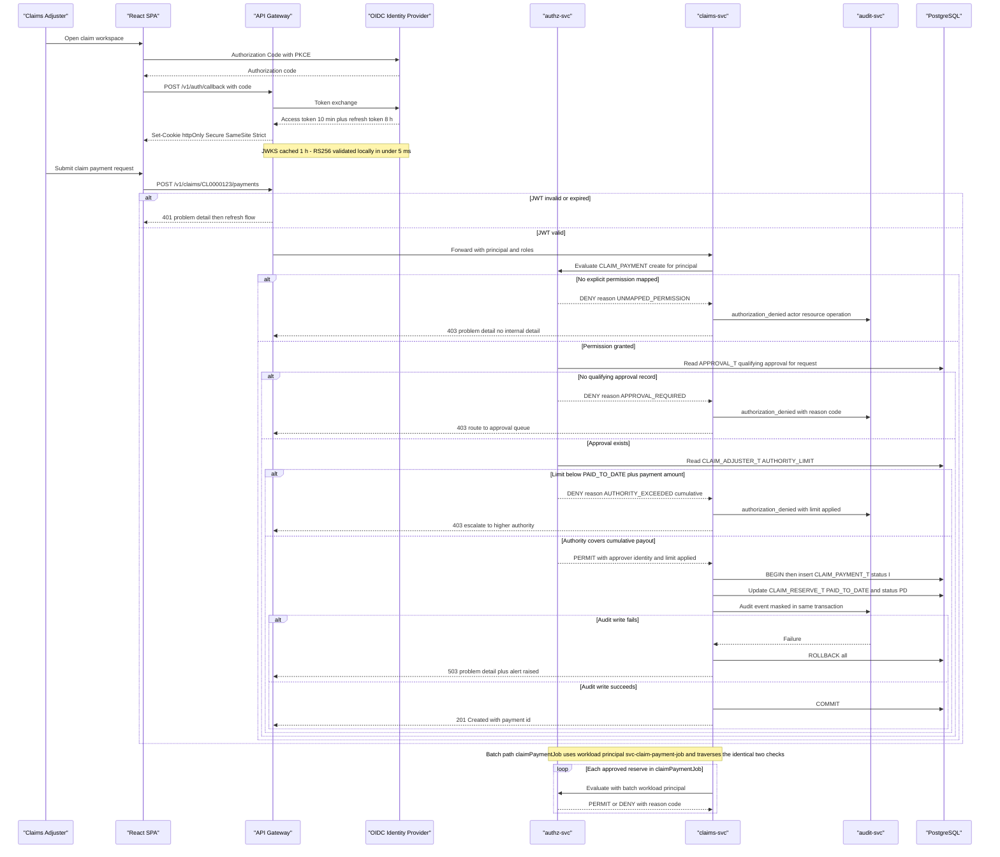
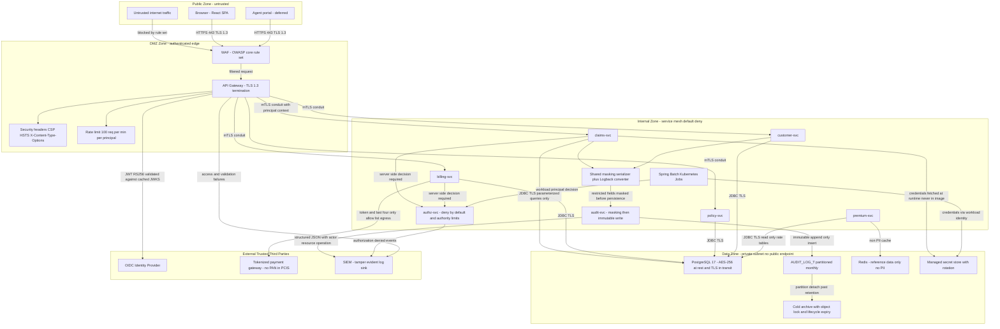
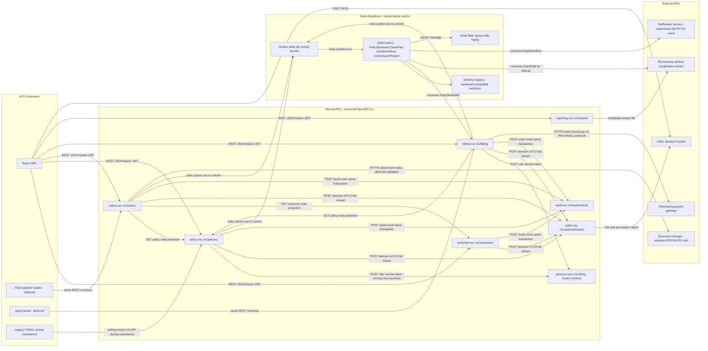
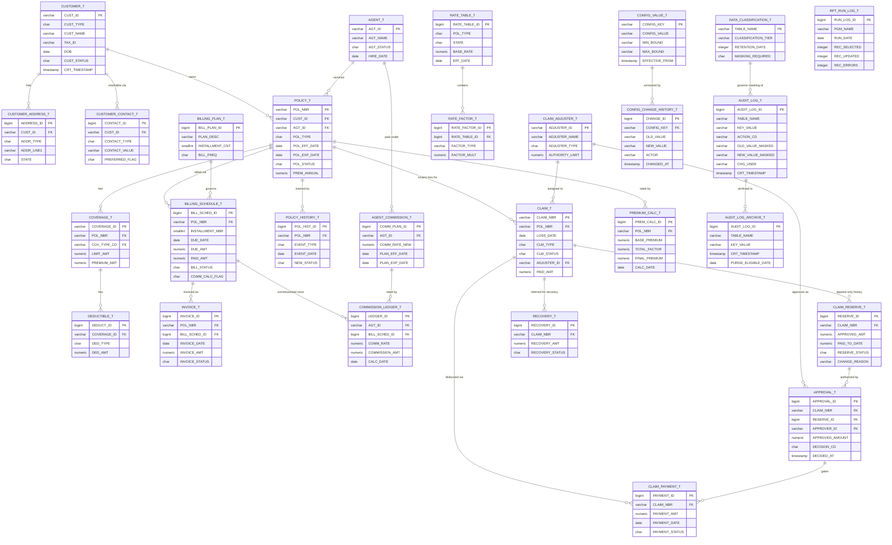

## Architecture Executive Summary

### Project Context

PCIS (Property & Casualty Insurance System) is the company's entire insurance operating system — customer master, agent management, quoting, underwriting, policy administration, premium rating, billing, payments, claims, reinsurance, documents, reporting, audit and security — implemented as a single IBM i (AS/400) application in fixed-format ILE COBOL with embedded static SQL against Db2 for i, driven exclusively by 5250 green-screen panels. The repository holds 39 members: 8 COBOL programs, 22 DDS display-file definitions, 2 Control Language members and 7 design documents describing 14 functional modules and a 55-table database.

Its users are claims adjusters and supervisors, customer service representatives, policy underwriters/administrators, insurance agents, batch operations engineers, and — as accountability stakeholders — Compliance & Internal Audit and Finance & Actuarial. The domain is regulated P&C insurance: audit immutability (SOC 2, SOX), personal-data masking and retention (GDPR/CCPA), and deny-by-default access control (OWASP A01) are architectural inputs, not later hardening.

### Current State — What the Code Actually Shows

Six batch programs share one hand-copied skeleton (`0000-MAIN` → `1000-INITIALIZE` → `2000-process` loop → `8000-WRITE-RUN-LOG` → `9000-TERMINATE`) with `SQLCODE` checked inline after every `EXEC SQL`. Three structural weaknesses are visible in source, not inferred:

1. **Authorization is absent where it matters most.** `CLM006B.cbl` selects `CLAIM_RESERVE_T` rows with `RESERVE_STATUS = 'AP'`, computes `HV-PAYMENT-AMT = HV-APPROVED-AMT - HV-PAID-TO-DATE`, and inserts `CLAIM_PAYMENT_T` with status `'I'` — with **no `SECCHK01` call and no reference to `CLAIM_ADJUSTER_T.AUTHORITY_LIMIT` anywhere in the program**. Its prologue claims it "VERIFIES PAYMENT AUTHORITY"; the PROCEDURE DIVISION does not. `CLM_Module_Design_Document.md` §6.3 openly records the approval-to-payment linkage as an unresolved open item.
2. **Audit-write failure does not stop the money.** In `BIL003B`, `CMM001B`, `PRM005B`, `POL006B` and `CLM006B`, a non-`'00'` return from `CALL 'AUDLOG01'` produces only a `DISPLAY` line; `PRM005B` states it explicitly in a comment: "AUDIT WRITE FAILURE IS LOGGED BUT DOES NOT ROLL BACK." Every one of those paths can leave a committed financial mutation with no audit record.
3. **Regulatory values are compiled in.** `WS-RETENTION-DAYS +365` and `WS-CHUNK-SIZE +5000` (AUD002B), `WS-LEAD-DAYS +15` (BIL003B), `WS-GRACE-DAYS +10` (PRM005B), `WS-RENEWAL-WINDOW-DAYS +60` (POL006B) and `WS-REI-CESSION-THRESHOLD 100000.00` (CLM006B) are WORKING-STORAGE literals, as are the actor identities `'BATCHAUD'`, `'BATCHBIL'`, `'BATCHCMM'`, `'BATCHPRM'`, `'BATCHCLM'`, `'BATCHREN'`.

The audit contract also drifts by caller: batch programs pass `WS-AUD-ACTION-CD PIC X(3)` with `X(30)` old/new values, while `CUS001A`/`POL001A` pass `X(1)` action codes with `X(100)` values and a wider `X(40)` key — two incompatible shapes of the same nine-parameter call.

### Target State

Six domain services (Claims, Customer, Policy, Premium, Billing, Reporting) plus two shared-kernel services (Authorization, Audit) on Java 21 / Spring Boot 3.5.x, containerised on Kubernetes; the six batch programs re-expressed as restartable Spring Batch jobs preserving legacy commit granularity exactly; the Db2 for i 55-table schema migrated to managed PostgreSQL 17 with `NUMERIC(11,2)`/`NUMERIC(9,2)` and `BigDecimal` end-to-end; the 22 DDS panels replaced by a WCAG 2.1 AA React web experience over versioned OpenAPI 3.1 contracts.

### Architectural Philosophy

| Principle | Rationale | Evidence it addresses |
|---|---|---|
| **Preserve behaviour to the cent, change the mechanism** | Parity is the cutover gate, so arithmetic and commit granularity are frozen while platform and controls change. | `HV-PREM-ANNUAL / HV-INSTALLMENT-CNT` (BIL003B), `COMPUTE ... ROUNDED` (CMM001B) |
| **Controls become code, not convention** | Two of the most-trusted components exist only as `CALL` targets; enforcement must be executable and testable. | `CLM006B` CALLS list declares only `AUDLOG01` |
| **Atomicity of mutation-plus-audit** | Policy forbids swallowing errors; an unrecorded financial mutation is a reportable finding. | `PRM005B` comment: audit failure does not roll back |
| **Configuration over recompilation** | Regulatory windows change on external timetables; a recompile is an unacceptable change vehicle. | Six tunables as WORKING-STORAGE literals |
| **One domain at a time, always reversible** | A 55-table, six-module insurer cannot be cut over at once; every phase needs a rehearsed rollback. | Library-copy promotion (`PCIS_CRTOBJ.clle`) offers no rollback path |

### Intent Alignment

Domain microservices ← module boundaries already evidenced in `PCIS_Enterprise_Architecture.md` §1.1. Shared kernel ← the phantom `AUDLOG01`/`SECCHK01` gap. Spring Batch ← the six repeated COBOL skeletons. PostgreSQL ← `PCIS_Database_Design.md` conventions on `DECIMAL` and SEQUENCE-generated business keys. Accessible UI ← 22 fixed 24×80 panels. Golden-output harness ← zero test members. Externalized configuration, PII/retention, CI/CD, versioned contracts, structured errors, set-based batch access and the reporting/document integration layer each trace to a specific code or design-document finding cited in the sections that follow.

### Architecture Decision Records

| Decision | Choice | Alternatives Considered | Rationale | Trade-offs |
|---|---|---|---|---|
| **AD-01 Decomposition** | Six domain services + two shared-kernel services, deployed independently | (a) Single Spring Boot modular monolith — simpler ops, one deployable, but a single cutover unit that defeats per-domain parallel run; (b) Fine-grained microservices per program (40+) — matches COBOL members but multiplies network calls across what are today in-process `CALL`s | Service boundaries mirror the module dependency map already published in `PCIS_Enterprise_Architecture.md` §1.1, and the decision anchor mandates per-domain rollout with parallel run — one service per domain makes a domain the atomic cutover and rollback unit | Eight deployables, eight pipelines, distributed tracing becomes mandatory; POLICY_T reads must cross a service boundary that is free today |
| **AD-02 Inter-service style** | Hybrid: synchronous REST for reads/queries, asynchronous domain events (transactional outbox → Kafka) for cross-domain state change | (a) All-synchronous REST — simplest, but couples Claims availability to Policy availability on every FNOL; (b) All-event/CQRS — best decoupling, but read-your-write staleness is unacceptable on a claim payment screen | Honors the user's explicit hybrid decision anchor; reads stay strongly consistent for the operator, while renewal→billing and payment→reinsurance handoffs (today overnight batch) become near-real-time without coupling uptime | Two integration idioms to operate and test; outbox adds a table and a relay per writing service |
| **AD-03 Batch runtime** | Spring Batch 5.x chunk-oriented jobs, chunk size set to legacy commit granularity | (a) Plain `@Scheduled` services — no restart or step metadata, reproducing today's "no restart point"; (b) Airflow-orchestrated SQL/dbt — excellent for set-based work but no per-item skip/retry or Java domain-rule reuse | `JobRepository` gives restart-from-last-committed-chunk, skip/retry and non-zero exit codes — exactly the four capabilities missing from the COBOL skeleton, where a chunk failure sets `WS-MORE-ROWS-SW` to `'N'` and simply ends the run | Chunk boundaries must be proven equal to COBOL commit points by fault-injection test, or parity breaks |
| **AD-04 Commit granularity** | One policy / installment / claim payment per chunk (chunk=1); archive job chunk ≤1,000 rows | (a) Larger chunks (500–1,000) for all jobs — faster, but changes failure semantics so one bad row blocks a batch of good ones; (b) One transaction per run — simplest, worst blast radius | The prologues state the contract: BIL003B/CMM001B/PRM005B/CLM006B/POL006B all say "ONE ... PER COMMIT CYCLE — A SINGLE FAILURE ... DOES NOT BLOCK THE REMAINING ...". Preserving it preserves observable behaviour; the archive job's 5,000-row blast radius is reduced to ≤1,000 as a deliberate safety improvement | chunk=1 forfeits JDBC batching throughput; recovered via partitioned parallel steps and set-based readers instead |
| **AD-05 Database** | Managed PostgreSQL 17, single region, Multi-AZ, PITR | (a) Stay on Db2 for i — zero migration risk, but retains platform lock-in and licence cost and blocks cloud-portable tooling; (b) Aurora Serverless v2 — elastic for month-end peaks but adds cost-model unpredictability for a 24×7 OLTP plus heavy batch profile | `NUMERIC(p,s)` preserves COMP-3 `S9(9)V99`/`S9(11)V99` semantics exactly, PostgreSQL SEQUENCE objects preserve the fixed-length business-key convention in `PCIS_Database_Design.md`, and partitioning turns audit retention into a metadata operation | Every `EXEC SQL` must be re-hosted (no static bind equivalent); Db2-for-i idioms (`FETCH FIRST :hv ROWS ONLY`, `VALUES CURRENT TIMESTAMP - :n DAYS`, `DAYS(x) - DAYS(y)`) each need an explicit rewrite |
| **AD-06 DR posture** | Single region, automated backups + PITR, RTO 4 h / RPO 15 min | (a) Active-active multi-region — near-zero RTO, but doubles cost and forces conflict resolution on monetary writes; (b) Backup-restore only — cheapest, RTO measured in days | Matches the user's decision anchor (hours-scale RTO/RPO) and improves materially on the current single-partition posture | A regional outage is a multi-hour business interruption; accepted and documented |
| **AD-07 Identity** | OAuth2/OIDC with a central IdP issuing JWTs, validated per service; Spring Security 6 `@PreAuthorize` with deny-by-default matchers | (a) Session/cookie gateway auth only — simpler UI, but batch workloads and service-to-service calls have no principal; (b) Per-service local user store — no cross-domain SSO, replicates today's fragmentation | Replaces `SET :HV-CURRENT-USER = CURRENT USER` and hard-coded `'BATCHCLM'` literals with a verifiable principal on both interactive and batch paths, which is prerequisite to enforcing `CLAIM_ADJUSTER_T.AUTHORITY_LIMIT` | JWT revocation latency bounded by 10-minute access-token TTL; IdP becomes a tier-0 dependency |
| **AD-08 Payments/PCI** | Tokenized third-party gateway; PCIS stores gateway token + last four only | (a) In-house card capture — full control, but pulls all six services into PCI-DSS scope; (b) Hosted redirect only — minimal scope but poor UX for CSR-assisted payment | Keeps PCIS permanently outside cardholder-data scope per the user's decision anchor; enforced by a CI check asserting no PAN/expiry/CVV column, log field or audit field exists | Gateway becomes a availability and reconciliation dependency; token migration is a vendor-lock consideration |
| **AD-09 Runtime platform** | Kubernetes (managed) with containerised services; batch as Kubernetes Jobs | (a) VM/systemd deployment — familiar, but no declarative scaling for month-end peaks; (b) Serverless functions — poor fit for multi-hour billing/archive runs and 15-minute-plus job durations | Matches the decision anchor and the workload profile: steady interactive traffic plus spiky nightly/monthly batch that should scale to zero between runs | Cluster operations, upgrade cadence and admission policy become new team responsibilities |
| **AD-10 CI/CD** | Forge Shipping pipeline: build → parallel security scans → registry push → approval gate → dev/staging/prod → post-deploy verification | (a) Hand-rolled shell scripts — fastest to start, no provenance or SBOM; (b) GitOps-only with no gate — good traceability but no separation of duty for production promotion | Supply-chain policy requires SCA in CI, verified component integrity and separation of duty for production promotion; a single declarative pipeline is the only place those can be enforced | Pipeline itself becomes a tier-0 supply-chain asset needing its own access control |
| **AD-11 Legacy coexistence** | Strangler by domain; Db2 for i remains system of record until a domain passes its gate; polling-based extraction with idempotent loads | (a) Big-bang cutover — shortest dual-run cost, unacceptable risk on billing/claims; (b) True CDC from Db2 for i — lower latency but journal-based capture is operationally uncertain on IBM i | The constraint that no financial mutation may be disturbed makes coexistence mandatory; designing for polling means CDC becomes an optimisation rather than a dependency | Sustained dual-platform operating cost across five phases; reconciliation tooling is a first-class deliverable |

```mermaid

```

---

## System Architecture Overview

### Current State

The existing system is a single-partition, four-tier-in-one-process design. `PCISMENU` dispatches to `<MOD>MNTP1` CL drivers, which `CALL` interactive COBOL programs bound to DDS display files (`CUSMNTD1`, `POLMNTD1`, `CLMFNLD1` … 22 panels). Those programs reach data through embedded static SQL bound as packages, and reach cross-cutting behaviour through in-process `CALL` to service programs in `INSCOM` — `AUDLOG01`, `SECCHK01`, `PRMCLC01`, `CUSVAL01`, `POLVAL01`, `CLMVAL01`, `RESCLC01`. Batch enters from the other side: `JOBSCHD1` (nightly — `PRM005B`, `CLM006B`, month-end `AUD002B`), `JOBSCHD2` (nightly renewal — `POL006B`) and `JOBSCHD3` (monthly billing/commission — `BIL003B`, `CMM001B`) submit jobs via `SBMJOB` against the same tables the interactive programs are using.

There is no API surface of any kind, no process boundary between presentation and business logic, and no trust boundary between a program and the service programs it calls — a `CALL` cannot be refused.

### Target State and What Changes

The target keeps the same seven functional groupings but makes each an independently deployable service behind an API gateway, with two things that do not exist today: an explicit authorization decision point and an audit sink that participates in the caller's transaction.

| Layer | Current | Target | Change type |
|---|---|---|---|
| Presentation | 22 DDS 24×80 panels via 5250 | React 19 + TypeScript SPA, WCAG 2.1 AA | Replaced |
| Edge | none | API gateway: TLS 1.3, JWT introspection, rate limit, security headers | New |
| Domain logic | 8 COBOL programs + design-only members | claims-svc, customer-svc, policy-svc, premium-svc, billing-svc, reporting-svc | Re-architected |
| Cross-cutting | `CALL 'AUDLOG01'`, `CALL 'SECCHK01'` | authz-svc, audit-svc — versioned contracts, aspect-enforced | Rebuilt as first-class |
| Rating | `PRMCLC01` facade over PRMRSK01/PRMUWR01/PRMDSC01/PRMSUR01/PRMTAX01 | premium-svc preserving the same six-stage pipeline internally | Ported, contract versioned |
| Batch | 6 COBOL programs under `JOBSCHD1/2/3` | 6 Spring Batch jobs as Kubernetes Jobs under an external scheduler | Re-expressed |
| Data | Db2 for i in `INSPRDDTA` | PostgreSQL 17 Multi-AZ + read replica + Redis + Kafka + S3 archive | Migrated |

### Key Design Decisions

**Gateway as the single trust transition.** Every request crosses exactly one place where an unauthenticated caller becomes an authenticated principal. Today that transition is implicit in the 5250 sign-on (`SGNON001.dspf`) and the `*LIBL` resolution of `SECCHK01`. Making it explicit is what allows the deny-by-default policy to be enforced and measured.

**Reporting reads a replica, never the OLTP primary.** `RPT_RUN_LOG_T` is written today by every batch program's `8000-WRITE-RUN-LOG` on the same tables billing and claims are mutating, and `PCIS_Enterprise_Architecture.md` lists RPT001A–RPT006A as reporting against operational tables. Moving report queries to a streaming read replica removes a known lock-contention source from the billing window.

**premium-svc is a hub and is therefore contract-frozen.** `POL001A`, `POL002A`, `POL006B` and the QTE module all `CALL 'PRMCLC01'`, with two visibly different parameter lists already in the codebase (`POL001A` passes pol-type/cov-type/territory/limit and receives premium, base-rate, factor, return-code; `POL006B` passes pol-type/state/old-premium and receives premium, return-code, uw-decision). The target exposes one versioned, additive-only OpenAPI contract with consumer-driven contract tests from Claims, Billing and Policy.

### Concrete Budgets

| Path | Budget | Basis |
|---|---|---|
| Gateway → service p95 (read) | ≤ 400 ms | Must not regress the measured green-screen baseline for the 8 highest-volume workflows |
| JWT validation (cached JWKS) | ≤ 5 ms | Local verification, no IdP round trip on the hot path |
| authz-svc decision p99 | ≤ 25 ms | In-path on every mutation; Redis-cached role/authority snapshot, 60 s TTL |
| audit-svc write (same transaction) | ≤ 15 ms | Same-database write via outbox; must not dominate the mutation |
| PostgreSQL pool per service | 20 interactive / 10 batch (HikariCP) | Keeps total connections bounded for 8 services plus 6 concurrent jobs |
| Redis reference-data TTL | 300 s (`CODE_TABLE_T`, `COVERAGE_TYPE_T`, `BILLING_PLAN_T`) | Slow-changing domains read on nearly every transaction |

```mermaid
flowchart TD
  subgraph clients["Client Layer"]
    webUi["React 19 SPA - WCAG 2.1 AA"]
    legacy5250["Legacy 5250 Panels - 22 DDS files during coexistence"]
    agentPortal["Agent Portal - deferred phase"]
  end
  subgraph edge["Edge and Trust Boundary"]
    gw["API Gateway - TLS 1.3 and OpenAPI 3.1"]
    idp["OIDC Identity Provider - JWT issuer"]
  end
  subgraph kernel["Shared Kernel Services"]
    authzSvc["authz-svc - deny by default and authority limits"]
    auditSvc["audit-svc - masked immutable audit events"]
    configSvc["config-and-rules-store - 6 regulatory tunables"]
  end
  subgraph domain["Domain Services"]
    claimsSvc["claims-svc - FNOL reserve approval payment"]
    customerSvc["customer-svc - master addresses contacts"]
    policySvc["policy-svc - issue endorse renew cancel"]
    premiumSvc["premium-svc - PRMCLC01 rating pipeline"]
    billingSvc["billing-svc - schedule invoice aging commission"]
    reportingSvc["reporting-svc - extracts and dashboards"]
  end
  subgraph batch["Batch Layer - Spring Batch on Kubernetes Jobs"]
    auditArchiveJob["auditArchiveJob - was AUD002B"]
    billingGenJob["billingGenerationJob - was BIL003B"]
    delinquencyJob["delinquencyAgingJob - was PRM005B"]
    renewalJob["policyRenewalJob - was POL006B"]
    claimPayJob["claimPaymentJob - was CLM006B"]
    commissionJob["commissionCalcJob - was CMM001B"]
  end
  subgraph data["Data Layer"]
    pgPrimary["PostgreSQL 17 primary - 55 tables Multi-AZ"]
    pgReplica["PostgreSQL read replica - reporting only"]
    redis["Redis - reference data cache 300s TTL"]
    kafka["Kafka - domain events via outbox"]
    s3Archive["Object store - audit cold archive with object lock"]
  end
  subgraph legacy["Legacy Platform - system of record until domain gate passes"]
    db2["Db2 for i in INSPRDDTA"]
    jobschd["JOBSCHD1 JOBSCHD2 JOBSCHD3 CL drivers"]
  end
  webUi -->|"HTTPS 443 JSON"| gw
  agentPortal -->|"HTTPS 443 JSON"| gw
  webUi -->|"OIDC PKCE redirect"| idp
  gw -->|"JWT validation via cached JWKS"| idp
  gw -->|"REST authorization decision"| authzSvc
  gw -->|"REST v1"| claimsSvc
  gw -->|"REST v1"| customerSvc
  gw -->|"REST v1"| policySvc
  gw -->|"REST v1"| billingSvc
  gw -->|"REST v1"| reportingSvc
  claimsSvc -->|"PreAuthorize plus authority limit check"| authzSvc
  billingSvc -->|"PreAuthorize"| authzSvc
  policySvc -->|"REST rating contract v1"| premiumSvc
  billingSvc -->|"REST rating contract v1"| premiumSvc
  claimsSvc -->|"same transaction audit event"| auditSvc
  billingSvc -->|"same transaction audit event"| auditSvc
  policySvc -->|"same transaction audit event"| auditSvc
  customerSvc -->|"same transaction audit event"| auditSvc
  claimsSvc -->|"JDBC BigDecimal NUMERIC"| pgPrimary
  customerSvc -->|"JDBC"| pgPrimary
  policySvc -->|"JDBC"| pgPrimary
  billingSvc -->|"JDBC"| pgPrimary
  premiumSvc -->|"JDBC read rate tables"| pgPrimary
  auditSvc -->|"JDBC partitioned insert"| pgPrimary
  premiumSvc -->|"rate and factor cache"| redis
  customerSvc -->|"CODE_TABLE_T cache"| redis
  policySvc -->|"PolicyRenewed event"| kafka
  claimsSvc -->|"ClaimPaid event"| kafka
  billingSvc -->|"consume PolicyRenewed"| kafka
  reportingSvc -->|"read only SQL"| pgReplica
  pgPrimary -->|"streaming replication"| pgReplica
  auditArchiveJob -->|"partition detach and verified copy"| s3Archive
  billingGenJob -->|"chunk one installment per commit"| pgPrimary
  delinquencyJob -->|"chunk one installment per commit"| pgPrimary
  renewalJob -->|"chunk one policy per commit"| pgPrimary
  claimPayJob -->|"authority check then chunk one payment per commit"| pgPrimary
  commissionJob -->|"chunk one installment per commit"| pgPrimary
  claimPayJob -->|"batch principal authority decision"| authzSvc
  jobschd -->|"unchanged for non migrated domains"| db2
  db2 -->|"polling extract and reconcile"| pgPrimary
  legacy5250 -->|"5250 for domains not yet cut over"| db2
```

---

## Data Flow Diagram

### Current State — Per-Row Round Trips and Silent Skips

The billing generation flow in `BIL003B` is the clearest example of the data-access pattern that must change. Its cursor `BIL-CSR` joins `POLICY_T`, `BILLING_PLAN_T` and `BILLING_SCHEDULE_T` with `GROUP BY` and `HAVING MAX(BS.INSTALLMENT_NBR) < BP.INSTALLMENT_CNT`, then for **each fetched row** issues two further database round trips before any work happens:

1. A frequency-dependent `VALUES (:HV-LAST-DUE-DATE + 1 MONTH | 3 MONTHS | 6 MONTHS | 1 YEAR) INTO :HV-NEXT-DUE-DATE`.
2. A `VALUES (DAYS(:HV-NEXT-DUE-DATE) - DAYS(CURRENT DATE)) INTO :HV-INSTALLMENT-NBR` — and note that `HV-INSTALLMENT-NBR` is being reused as a scratch days-out counter, a quirk that must be preserved in behaviour while being eliminated in mechanism.

Only then does `IF HV-INSTALLMENT-NBR <= WS-LEAD-DAYS` decide whether to generate. Candidates outside the 15-day window are **silently skipped** — no exception row, no counter, nothing. `WS-CNT-ELIGIBLE` counts them as eligible even though nothing happened.

`PRM005B` repeats the shape: a per-row `VALUES (DAYS(CURRENT DATE) - DAYS(:HV-DUE-DATE)) INTO :HV-DAYS-PAST-DUE` before deciding paid/late/due against `WS-GRACE-DAYS +10`.

### Target Flow

All date arithmetic and days-out computation moves into the candidate query, so the reader emits fully-decided items. The `ItemProcessor` becomes pure domain logic on `BigDecimal`, and each write group — installment + invoice + audit event — commits as one transaction per item, preserving `BIL003B`'s stated "ONE POLICY/INSTALLMENT PER COMMIT CYCLE".

| Stage | Current | Target | Measured target |
|---|---|---|---|
| Candidate selection | Cursor + 2 round trips per row | Single set-based `SELECT` computing `next_due_date` and `days_out` in SQL | 0 per-row round trips for date arithmetic |
| Key allocation | `VALUES NEXT VALUE FOR SEQ_BILL_SCHED_ID` once per item | Sequence allocation in blocks of 100 | ≥90% reduction in sequence round trips |
| Amount computation | `COMPUTE HV-INSTALLMENT-AMT = HV-PREM-ANNUAL / HV-INSTALLMENT-CNT` (COMP-3) | `BigDecimal.divide(scale 2, HALF_UP)` asserted against golden output | 100% match at `NUMERIC(9,2)` |
| Skipped candidates | Silent | Emitted to an exceptions list and a metric | 100% of skips visible |
| Audit | `CALL 'AUDLOG01'`, failure printed | Outbox row in the same transaction | 0 mutations without audit |

### Commission and Claim-Payment Flows

`CMM001B` reads paid installments (`BILL_STATUS = 'P' AND COMM_CALC_FLAG IS NULL`), looks up the in-force plan (`EFF_DATE <= CURRENT DATE AND (EXP_DATE IS NULL OR EXP_DATE > CURRENT DATE) FETCH FIRST 1 ROW ONLY`), computes `COMPUTE HV-COMMISSION-AMT ROUNDED = HV-PAID-AMT * (HV-COMM-RATE / 100)`, inserts `COMMISSION_LEDGER_T` and stamps `COMM_CALC_FLAG = 'Y'` — the idempotency guard that makes "commissioned exactly once" true. That flag-based guard is preserved verbatim; an agent with no in-force plan increments `WS-CNT-NO-PLAN` today and becomes an actionable exception in the target.

`CLM006B` computes `HV-OUTSTANDING-AMT = HV-APPROVED-AMT - HV-PAID-TO-DATE`, moves it wholesale to `HV-PAYMENT-AMT` (always the full outstanding amount — a behaviour to preserve, not "improve"), inserts the payment, sets `PAID_TO_DATE = APPROVED_AMT` and `RESERVE_STATUS = 'PD'`, and only if `HV-PAYMENT-AMT > WS-REI-CESSION-THRESHOLD` inserts `RECOVERY_T` with status `'PEND'`. In the target the authority decision is inserted **before** the payment write, in the same transaction.



---

## Authentication & Authorization Flow

### Current State — Authorization by Convention

Today there are three distinct authorization mechanisms, none of them enforceable at the point of the write:

1. **5250 sign-on** via `SGNON001.dspf` establishes an IBM i job user profile. Interactive programs recover it with `EXEC SQL SET :HV-CURRENT-USER = CURRENT USER` (`CUS001A` 1100-RETRIEVE-CURRENT-USER) — and fall back to the literal `'PCISBATCH'` if `SQLCODE NOT = 0`.
2. **Menu-option gating** via `ROLE_MENU_T`. The design documents are explicit that this is the only gate: `CLM_Module_Design_Document.md` §6.3 says the approval role check is "enforced at the CL driver / menu-option level **before this program is even reachable**", and `CUS_Module_Design_Document.md` §6.3 says F6/F9 visibility is a panel-level concern. That is presentation-layer authorization — exactly what OWASP A01 forbids relying on.
3. **Batch identity by literal.** `CLM006B` runs as `'BATCHCLM'`, `BIL003B` as `'BATCHBIL'`, `AUD002B` as `'BATCHAUD'`, `POL006B` as `'BATCHREN'`. There is no principal, so there is nothing to authorize.

The consequence is concrete and is the single highest-value gap in the system: `CLM006B` inserts `CLAIM_PAYMENT_T` with no reference to `CLAIM_ADJUSTER_T.AUTHORITY_LIMIT` and no reference to `APPROVAL_T` (which exists as table 43 in `PCIS_Database_Design.md` but is unused by the batch). `CLM_Module_Design_Document.md` §6.4 specifies for the interactive path that authority is evaluated on **cumulative** payout — `AUTHORITY_LIMIT >= (PAID_AMT + requested)` — precisely to prevent circumvention by splitting payments. The batch path implements none of it.

### Target Design

| Concern | Mechanism | Concrete value |
|---|---|---|
| Human authentication | OIDC Authorization Code + PKCE against central IdP | Access token TTL 10 min, refresh 8 h, rotated on use |
| Token transport | httpOnly, Secure, SameSite=Strict cookie plus bearer to gateway | No token in localStorage |
| Token validation | Local RS256 verification against cached JWKS | JWKS cache 1 h; validation ≤5 ms, no IdP hop |
| Service-to-service | OAuth2 client credentials with workload identity | Token TTL 15 min |
| Batch identity | Workload principal `svc-claim-payment-job`, never a literal | Recorded as actor in every audit event |
| Coarse authorization | Spring Security 6 deny-by-default request matchers | `anyRequest().denyAll()` as the terminal rule |
| Fine authorization | `@PreAuthorize` on every mutating method + authority-limit domain check | Build-time check fails on any unannotated mutating method |
| Decision latency | authz-svc, Redis-cached role and authority snapshot | p99 ≤25 ms, cache TTL 60 s |
| Denial handling | RFC 9457 problem detail, HTTP 403, no internal detail | `authorization_denied` audit event with actor, resource, operation |

### The Two Checks That Must Both Pass

For a claim disbursement — interactive or batch — the target requires, inside one transaction:

1. **A qualifying approval exists.** A row in `APPROVAL_T` linked to the payment request, not a free-text `CLAIM_NOTE_T` entry. This closes open design item 8 ("mechanical linkage between CLM003A approval and CLM004A payment authority check") from `PCIS_Enterprise_Architecture.md` §7.4.
2. **The payer's authority covers cumulative payout.** `CLAIM_ADJUSTER_T.AUTHORITY_LIMIT >= PAID_TO_DATE + payment_amount`, per `CLM_Module_Design_Document.md` §6.4, with a distinct reason code from the missing-approval denial.

Both failures are denials with distinct reason codes; both are audited; neither leaks a stack trace. Segregation of duties is preserved as a design principle — approval and disbursement remain distinct operations requiring distinct permissions — but becomes code-enforced rather than procedural.



---

## Security Architecture

### Current State — One Implicit Zone

The present security model is the IBM i partition itself. Object authority and library lists (`INSPRD INSPRDDTA INSCOM QGPL` in production per `PCIS_Enterprise_Architecture.md` §6.1) are the boundary; inside it, any program can `CALL` any service program and any program with the right library list can reach `INSPRDDTA` — which `PCIS_Enterprise_Architecture.md` §6 identifies as **the only library housing real customer/policy/claim data**. There is no network segmentation between presentation, logic and data because there are no separate processes.

Three specific exposures are visible in code:

- **Unmasked PII in the audit path.** `CUSTOMER_T` carries `TAX_ID VARCHAR(11)` annotated "encrypted at app layer", plus `DOB`, `EMAIL`, `PHONE`. `CUS001A` handles all of them and `CUS_Module_Design_Document.md` §4.4 specifies Full audit level — one row per changed field with `OLD_VALUE`/`NEW_VALUE`. Those raw values flow through `AUDLOG01` into `AUDIT_LOG_T` and then, via `AUD002B`, into `AUDIT_LOG_ARCHIVE_T` which **has no purge stage anywhere in the system**.
- **Masking is a display convention only.** `CUS_Module_Design_Document.md` §5.2 shows `Tax ID (SSN/EIN) . . . [_________**] (masked beyond last 4 digits)` on the panel — masking at render time, while the stored and audited value is clear.
- **Errors and identity.** `CUS_Module_Design_Document.md` §4.3 correctly routes `SQLCODE < 0` to a generic CUS0099 message, but the batch programs `DISPLAY` raw `SQLCODE` values to the job log with business keys alongside them.

### Target — Four Zones with Explicit Conduits

| Zone | Contents | Ingress control | Data at rest |
|---|---|---|---|
| Public | Browser, agent portal | TLS 1.3 only, HSTS, CSP, X-Content-Type-Options | n/a |
| DMZ | WAF, API gateway | JWT validation, rate limit 100 req/min per principal, allow-list egress | none |
| Internal | 8 services, batch jobs | mTLS between pods, NetworkPolicy default-deny | ephemeral only |
| Data | PostgreSQL, Redis, Kafka, object store | Private subnet, no public endpoint, IAM/workload identity | AES-256 |

**Classification and masking, applied at creation not at display.** All 55 tables carry a tier; a build-time check fails if any table is unclassified. Restricted-tier fields (`CUSTOMER_T.TAX_ID`, `DOB`, `EMAIL`, `PHONE`; `CLAIM_PAYMENT_T` payee) are masked by an annotation-driven Jackson serializer **before** the audit event is constructed, and by a Logback masking converter before any log line is emitted. Tax ID renders as last four only. An explicit, permission-gated, itself-audited unmask action exists for authorised investigators.

**Retention with a real purge.** `AUDIT_LOG_T` is partitioned monthly. Retention is a partition-detach operation rather than the current `DELETE FROM AUDIT_LOG_T` in `AUD002B` 2300. Detached partitions move to an object store with Object Lock and lifecycle expiry; a purge stage performs physical deletion or cryptographic erasure past tier retention and records the evidence in the run log. Minimum audit retention 1 year per policy; verification failure quarantines the partition and alerts rather than halting the whole run as `AUD002B` does today (`MOVE 'N' TO WS-MORE-ROWS-SW`).

**Supply chain.** Parallel SCA, SAST, secret and image scanning in CI; CycloneDX SBOM per release; signed images with digest-pinned deployment; production promotion requires a distinct approver from the committer.

**PCI scope.** Cardholder data never enters PCIS. An automated check asserts no PAN/expiry/CVV column exists in any migrated schema, no such field appears in any log or audit record, and only gateway token plus last four are persisted.

**Not applicable.** The IEC 62443 zone/conduit, OT firmware-integrity and safety-critical-isolation policies target manufacturing OT estates. PCIS has no OT devices, PLCs or SIS/SIL-rated systems; the zone/conduit *discipline* is nonetheless adopted above as a defence-in-depth model.



---

## Deployment Architecture

### Current State — Two CL Members and Tribal Knowledge

The entire build and deployment capability of PCIS consists of `PCIS_CRTOBJ.clle` (object creation) and `JOBSCHD_NEW_DRIVERS.clle` (scheduler objects), living in `INSTOOLS`. Promotion is manual library copy along `INSDEV → INSTST → INSPRD` (`PCIS_Enterprise_Architecture.md` §6). There is no build manifest, no dependency inventory, no container definition, no infrastructure-as-code, no test execution and no rollback mechanism other than restoring a saved library. Compile order and library setup are undocumented.

This matters beyond convenience: without a pipeline there is nowhere to enforce the SCA requirement, nowhere to run the golden-output regression suite that is the parity gate, and nowhere to enforce separation of duty for production promotion.

### Target — Forge Shipping Pipeline

A single declarative pipeline per service, using the Forge Shipping step catalog. Java services build with `build:maven` (Maven 3.9 multi-module with a shared BOM), then containerise via `build:docker`. Four security scans run in parallel and must all pass before any registry push:

| Stage | Forge step | Gate condition |
|---|---|---|
| Build | `build:maven` | Compile + unit tests green; ≥90% line coverage on monetary calculation packages |
| Build | `build:docker` | Reproducible image, non-root user, distroless base |
| Scan | `scan:sonarqube` | 0 new blockers, quality gate pass |
| Scan | `scan:snyk` | 0 critical/high CVEs in direct or transitive dependencies |
| Scan | `scan:gitleaks` | 0 secrets detected |
| Scan | `scan:semgrep` | 0 high-severity findings; custom rule: every mutating method annotated |
| Scan | `scan:grype` | 0 critical image CVEs; CycloneDX SBOM emitted |
| Push | `push:ecr` | Image signed, digest recorded |
| Deploy | `deploy:helm` → dev | Flyway migration applies cleanly to a fresh database |
| Test | `test:generic` | Testcontainers integration + golden-output batch regression + accessibility scan |
| Deploy | `deploy:helm` → staging | 45-day-equivalent parity dataset reconciles |
| Gate | manual approval | Approver distinct from committer — separation of duty |
| Deploy | `deploy:argocd` → prod | Canary 10% for 30 min, then progressive rollout |
| Test | `test:speedscale` | Replayed production traffic; p95 within baseline |

**Interim legacy build.** During coexistence a scripted job invokes `CRTSQLCBLI`/`CRTPGM` on IBM i so the COBOL baseline stays buildable and patched — mandatory, because parallel-run comparison requires a runnable legacy side.

**Rollback.** Argo CD keeps the previous release revision; rollback is `helm rollback` to the prior digest plus, if a Flyway migration ran, its paired down-migration or a PITR restore. Target rollback execution ≤15 minutes. Because migrations during coexistence are additive-only (expand-then-contract), most rollbacks require no schema change at all.

**Batch deployment differs from services.** Batch jobs deploy as Kubernetes `Job`/`CronJob` manifests rather than long-running `Deployment`s, scaling to zero between runs. Their gate additionally requires a fault-injection test proving restart from the last committed chunk leaves 0 duplicate and 0 orphaned financial records.

**Concrete targets.** Clean-checkout build and deploy of any service in ≤30 minutes by an engineer new to it; 100% of schema changes through versioned migrations; 0 manual library-copy steps in the migrated path.

```mermaid
flowchart LR
  subgraph source["Source"]
    commit["Git commit or PR to main"]
    tag["Release tag semver"]
    flywaySrc["Flyway migration scripts in repo"]
  end
  subgraph build["Build"]
    buildMaven["build:maven - Maven 3.9 multi module with BOM"]
    unitTest["Unit tests JUnit 5 - 90 percent on monetary code"]
    buildDocker["build:docker - distroless non root image"]
  end
  subgraph scan["Security Scan - parallel all must pass"]
    scanSonar["scan:sonarqube - quality gate"]
    scanSnyk["scan:snyk - SCA transitive deps"]
    scanGitleaks["scan:gitleaks - secret detection"]
    scanSemgrep["scan:semgrep - unannotated mutation rule"]
    scanGrype["scan:grype - image CVE and CycloneDX SBOM"]
    scanMerge["Scan merge gate"]
  end
  subgraph push["Publish"]
    pushEcr["push:ecr - signed image with digest"]
  end
  subgraph deployDev["Deploy Dev"]
    helmDev["deploy:helm - dev namespace"]
    migrateDev["Flyway migrate on fresh database"]
    testDev["test:generic - Testcontainers integration"]
  end
  subgraph deployStg["Deploy Staging"]
    helmStg["deploy:helm - staging namespace"]
    goldenTest["Golden output batch regression 6 jobs"]
    faultInject["Fault injection restart test zero duplicates"]
    a11yTest["Accessibility scan zero critical zero serious"]
    parityRecon["Parity reconciliation against Db2 baseline"]
  end
  subgraph gate["Promotion Gate"]
    approval["Manual approval - approver distinct from committer"]
  end
  subgraph deployProd["Deploy Production"]
    argoProd["deploy:argocd - prod cluster"]
    canary["Canary 10 percent for 30 min"]
    progressive["Progressive rollout to 100 percent"]
    batchJobs["Kubernetes Job and CronJob manifests"]
  end
  subgraph verify["Post Deploy Verification"]
    speedscale["test:speedscale - replay traffic p95 within baseline"]
    sloWatch["SLO watch - error rate under 1 percent rolling 24 h"]
    rollback["Automated rollback to prior digest under 15 min"]
  end
  subgraph legacyBuild["Legacy Coexistence Build"]
    ibmiBuild["Scripted CRTSQLCBLI and CRTPGM on IBM i"]
    libPromote["INSDEV to INSTST to INSPRD promotion recorded"]
  end
  commit --> buildMaven
  tag --> buildMaven
  flywaySrc --> migrateDev
  buildMaven --> unitTest
  unitTest --> buildDocker
  buildDocker --> scanSonar
  buildDocker --> scanSnyk
  buildDocker --> scanGitleaks
  buildDocker --> scanSemgrep
  buildDocker --> scanGrype
  scanSonar --> scanMerge
  scanSnyk --> scanMerge
  scanGitleaks --> scanMerge
  scanSemgrep --> scanMerge
  scanGrype --> scanMerge
  scanMerge -->|"all gates green"| pushEcr
  pushEcr --> helmDev
  helmDev --> migrateDev
  migrateDev --> testDev
  testDev -->|"integration green"| helmStg
  helmStg --> goldenTest
  goldenTest --> faultInject
  faultInject --> a11yTest
  a11yTest --> parityRecon
  parityRecon -->|"cent level match"| approval
  approval --> argoProd
  argoProd --> canary
  canary --> progressive
  argoProd --> batchJobs
  progressive --> speedscale
  speedscale --> sloWatch
  sloWatch -->|"breach triggers"| rollback
  rollback --> argoProd
  commit --> ibmiBuild
  ibmiBuild --> libPromote
```



---

## Component Architecture

### Current State — Module Boundaries Exist, Enforcement Does Not

`PCIS_Enterprise_Architecture.md` §1.1 already publishes a clean module dependency map: CUS→QTE, QTE→UND, UND→POL, POL↔PRM, POL→BIL, BIL→PAY, POL→CLM, CLM→REI, CLM→PAY, with SEC and AUD as cross-cutting. The naming convention is disciplined — `<MOD><###><A|B|S>` with 001=Create, 002=Maintain, 003=Inquiry.

But the boundaries are documentary. Coupling is expressed three ways, none checkable at build time:

1. **Prologue comment blocks.** Each program declares `CALLS` and `TABLES` lists in comments. `CLM006B`'s CALLS list says `AUDLOG01` only; its prologue also claims it verifies payment authority. Nothing reconciles the claim against the code.
2. **In-process `CALL` with copybook parameter blocks.** `WS-AUDLOG01-INTERFACE` and `WS-SECCHK01-INTERFACE` are described in `PCIS_Enterprise_Architecture.md` §5.3 as "standardized parameter blocks" — yet the batch and interactive variants demonstrably differ in field widths.
3. **Direct table reads across module lines.** `CMM001B` (AGT module) reads `POLICY_T` to get `AGENT_ID`; `BIL003B` (BIL) reads `POLICY_T` for `PREM_ANNUAL`; `CLM006B` (CLM) reads `CLAIM_T` joined to get `POL_NBR`. `POLICY_T` is read by nearly every module — the highest fan-in entity in the system.

### Target — Same Boundaries, Enforced

| Component | Replaces | Fan-in risk | Contract control |
|---|---|---|---|
| customer-svc | CUS001A–CUS005A | Read by policy, claims, reporting | Published read view, versioned OpenAPI |
| policy-svc | POL001A–POL005A, POL006B | **Highest** — read by billing, claims, commission, reporting | Additive-only schema, consumer-driven contract tests from 4 consumers |
| premium-svc | PRMCLC01 + PRMRSK01/UWR01/DSC01/SUR01/TAX01 | Called by policy, billing, quote | Frozen v1 rating contract, breakage fails the build |
| billing-svc | BIL001A–BIL004A, BIL003B, PRM005B, CMM001B | Read by reporting, commission | Versioned events for aging and payment |
| claims-svc | CLM001A–CLM005A (design-only), CLM006B | Reads policy, customer | Event-driven reinsurance referral |
| reporting-svc | RPT001A–RPT006A | Reads everything | Read replica only, never OLTP primary |
| authz-svc | SECCHK01 (no source) | Called by every mutating path | Single versioned decision contract |
| audit-svc | AUDLOG01 (no source) | Called by every mutating path | **One** normalised contract resolving the X(1)/X(3) and X(30)/X(100) drift |

### Blast-Radius Management for policy-svc

Because `POLICY_T` has the highest fan-in, policy-svc migrates **last among the transactional domains** (Phase 4), after its consumers have proven contracts. Three controls bound the blast radius:

- **Published read contract**, not shared tables — consumers read `GET /v1/policies/{polNbr}` or a projection, never the physical table.
- **Additive-only evolution.** No column removal or type narrowing while any consumer is unmigrated.
- **CI drift check.** A build step reconciles each service's declared dependencies against its actual calls — turning the prologue-comment convention into a build failure, which is precisely what today's comment blocks cannot do.

### Internal Structure per Service

Each service uses a four-layer arrangement with dependency injection throughout, so domain logic is testable without infrastructure mocks: `controller` (HTTP, RFC 9457 errors) → `application` (use case, transaction boundary, `@PreAuthorize`) → `domain` (pure `BigDecimal` rules, no framework imports) → `infrastructure` (JPA repositories, jOOQ/JdbcClient for set-based batch reads, outbox writer). The rating pipeline retains its six-stage order internally as separate collaborators mirroring PRMRSK01/PRMUWR01/PRMDSC01/PRMSUR01/PRMTAX01, so actuarial logic can change independently of tax logic exactly as the design document intends.

```mermaid
flowchart TD
  subgraph presentation["Presentation Modules"]
    claimWorkspace["claim-workspace - FNOL reserve payment views"]
    customerView["customer-360-view"]
    policyDesk["policy-desk - issue endorse renew cancel"]
    billingDesk["billing-and-collections-desk"]
    approvalQueue["supervisor-approval-queue"]
  end
  subgraph claimsDomain["claims-svc"]
    clmController["ClaimController - REST v1"]
    fnolUseCase["RegisterFnolUseCase - was CLM001A"]
    reserveUseCase["AdjustReserveUseCase - was CLM002A append only"]
    approvalUseCase["RecordApprovalUseCase - was CLM003A writes APPROVAL_T"]
    paymentUseCase["IssueClaimPaymentUseCase - was CLM004A and CLM006B"]
    claimRepo["ClaimRepository and ReserveRepository"]
  end
  subgraph policyDomain["policy-svc - highest fan in"]
    polController["PolicyController - REST v1"]
    issueUseCase["IssuePolicyUseCase - was POL001A"]
    endorseUseCase["EndorsePolicyUseCase - was POL002A optimistic lock"]
    renewalUseCase["RenewPolicyUseCase - was POL006B atomic per policy"]
    cancelUseCase["CancelPolicyUseCase - was POL005A refund origination"]
    policyReadView["PolicyReadView - published contract for consumers"]
  end
  subgraph premiumDomain["premium-svc - contract frozen v1"]
    ratingApi["RatingController - POST v1 rate"]
    riskScorer["RiskScoringService - was PRMRSK01"]
    uwRules["UnderwritingRuleEngine - was PRMUWR01 accept refer decline"]
    rateLookup["BaseRateAndFactorLookup - RATE_TABLE_T and RATE_FACTOR_T"]
    discountEngine["DiscountEngine - was PRMDSC01 stacking groups"]
    surchargeEngine["SurchargeEngine - was PRMSUR01 mandatory uncapped"]
    taxEngine["TaxEngine - was PRMTAX01 compound flag ordering"]
    calcSnapshot["PremiumCalcSnapshotWriter - PREMIUM_CALC_T"]
  end
  subgraph billingDomain["billing-svc"]
    bilController["BillingController - REST v1"]
    scheduleGen["InstallmentGenerationJob - was BIL003B"]
    agingJob["DelinquencyAgingJob - was PRM005B"]
    commissionJob["CommissionCalcJob - was CMM001B"]
    invoiceWriter["InvoiceWriter - INVOICE_T"]
    gatewayAdapter["TokenizedGatewayAdapter - token and last four only"]
  end
  subgraph customerDomain["customer-svc"]
    cusController["CustomerController - REST v1"]
    createCustomer["CreateCustomerUseCase - was CUS001A duplicate resolution"]
    searchCustomer["SearchCustomerUseCase - was CUS004A capped result set"]
    deleteCustomer["DeactivateCustomerUseCase - was CUS005A dependency check"]
  end
  subgraph kernelDomain["Shared Kernel"]
    authzApi["AuthorizationService - was SECCHK01"]
    authorityCheck["AuthorityLimitEvaluator - cumulative payout rule"]
    auditApi["AuditService - was AUDLOG01 single normalised contract"]
    maskingSerializer["ClassificationMaskingSerializer"]
    configStore["ConfigAndRulesStore - retention lead grace renewal threshold chunk"]
    outboxRelay["OutboxRelay - publishes domain events"]
  end
  subgraph reportingDomain["reporting-svc"]
    extractJobs["RegulatoryAndManagementExtracts - was RPT001A to RPT006A"]
    runLogWriter["BatchRunLogWriter - RPT_RUN_LOG_T"]
    auditArchiveJob["AuditArchiveAndPurgeJob - was AUD002B plus purge stage"]
  end
  claimWorkspace -->|"REST JSON"| clmController
  approvalQueue -->|"REST JSON"| clmController
  customerView -->|"REST JSON"| cusController
  policyDesk -->|"REST JSON"| polController
  billingDesk -->|"REST JSON"| bilController
  clmController --> fnolUseCase
  clmController --> reserveUseCase
  clmController --> approvalUseCase
  clmController --> paymentUseCase
  fnolUseCase -->|"validate policy in force on loss date"| policyReadView
  paymentUseCase -->|"requires qualifying approval record"| approvalUseCase
  paymentUseCase -->|"authority decision before write"| authorityCheck
  paymentUseCase --> claimRepo
  polController --> issueUseCase
  polController --> endorseUseCase
  polController --> renewalUseCase
  polController --> cancelUseCase
  issueUseCase -->|"REST rating contract v1"| ratingApi
  endorseUseCase -->|"REST rating contract v1"| ratingApi
  renewalUseCase -->|"REST rating contract v1"| ratingApi
  issueUseCase -->|"originate first installment"| scheduleGen
  cancelUseCase -->|"void future installments"| scheduleGen
  ratingApi --> riskScorer
  riskScorer --> uwRules
  uwRules -->|"decline stops pipeline"| ratingApi
  uwRules -->|"accept or refer"| rateLookup
  rateLookup --> discountEngine
  discountEngine --> surchargeEngine
  surchargeEngine --> taxEngine
  taxEngine --> calcSnapshot
  bilController --> scheduleGen
  bilController --> agingJob
  bilController --> commissionJob
  scheduleGen --> invoiceWriter
  commissionJob -->|"read agent on policy"| policyReadView
  bilController -->|"HTTPS token exchange"| gatewayAdapter
  cusController --> createCustomer
  cusController --> searchCustomer
  cusController --> deleteCustomer
  deleteCustomer -->|"dependency count check"| policyReadView
  fnolUseCase -->|"deny by default"| authzApi
  issueUseCase -->|"deny by default"| authzApi
  scheduleGen -->|"deny by default"| authzApi
  createCustomer -->|"deny by default"| authzApi
  authzApi --> authorityCheck
  fnolUseCase -->|"audit event same transaction"| auditApi
  paymentUseCase -->|"audit event same transaction"| auditApi
  scheduleGen -->|"audit event same transaction"| auditApi
  commissionJob -->|"audit event same transaction"| auditApi
  renewalUseCase -->|"audit event same transaction"| auditApi
  createCustomer -->|"audit event same transaction"| auditApi
  auditApi --> maskingSerializer
  scheduleGen -->|"read lead days"| configStore
  agingJob -->|"read grace days"| configStore
  renewalUseCase -->|"read renewal window"| configStore
  paymentUseCase -->|"read reinsurance threshold"| configStore
  auditArchiveJob -->|"read retention days and chunk size"| configStore
  paymentUseCase -->|"outbox row"| outboxRelay
  renewalUseCase -->|"outbox row"| outboxRelay
  scheduleGen -->|"run counts"| runLogWriter
  agingJob -->|"run counts"| runLogWriter
  auditArchiveJob -->|"purge evidence"| runLogWriter
  extractJobs -->|"read replica only"| runLogWriter
```



---

## API Integration Architecture

### Current State — Zero API Surface

PCIS has no HTTP endpoint, no service definition, no message contract. Integration happens by exactly three mechanisms:

1. **In-process `CALL` with a positional parameter list.** `CALL 'AUDLOG01' USING` nine parameters; `CALL 'PRMCLC01' USING` six (POL006B) or eight (POL001A) parameters; `CALL 'CUSVAL01'`. Position is the contract; a width change is a silent truncation, not a compile error across separately-compiled callers.
2. **`LINKAGE SECTION` parameters between programs.** `POL001A` takes `LK-CALLING-PGM, LK-CUST-ID, LK-AGT-ID, LK-PROP-ID, LK-QUOTE-ID, LK-RETURN-POL-NBR`; `CUS001A` takes `LK-CALLING-PGM, LK-RETURN-CUST-ID`. `LK-CALLING-PGM` exists specifically to feed the audit `PROGRAM_NAME` — a hand-rolled correlation identifier.
3. **Shared tables.** `RECOVERY_T` is CLM006B's handoff to the REI module; `REFUND_T` is POL005A's handoff to PAY; `BILLING_SCHEDULE_T` is POL001A's handoff to BIL. These are database-as-integration-bus.

The `NOTIFY01` event/notification interface is drawn in `PCIS_Enterprise_Architecture.md` §1 and explicitly labelled **future** — no event distribution exists.

### Target — Versioned REST for Reads, Events for Cross-Domain State Change

Honouring the hybrid decision anchor: reads and queries are synchronous REST so an operator never sees stale data on a payment screen; cross-domain state propagation is asynchronous so Claims availability never depends on Billing availability.

| Surface | Style | Auth | Versioning | Error format |
|---|---|---|---|---|
| `/v1/customers` | REST GET/POST/PATCH | Bearer JWT + `@PreAuthorize` | URI major, additive minor | RFC 9457 problem detail |
| `/v1/policies` | REST + published read projection | Bearer JWT | Additive-only while consumers unmigrated | RFC 9457 |
| `/v1/claims/{clmNbr}/payments` | REST POST | Bearer JWT + approval + authority check | v1 frozen | RFC 9457 with distinct reason codes |
| `/v1/rating` | REST POST | Service token | **Frozen v1**, consumer-driven contract tests | RFC 9457; `underwriting_declined` is an explicit outcome, never a zero premium |
| `/v1/billing/schedules` | REST GET/POST | Bearer JWT | Additive | RFC 9457 |
| `/v1/audit/events` | REST POST (internal only) | mTLS + service token | v1 normalised | fail-closed |
| `/v1/authz/decisions` | REST POST (internal only) | mTLS + service token | v1 | fail-closed |
| Domain events | Kafka via transactional outbox | mTLS, schema registry | Schema evolution backward-compatible | DLQ with replay |

### Resolving the Audit Contract Drift

The single most important contract decision is normalising the audit interface. Two shapes exist in the current codebase for the same nine-parameter call:

| Parameter | Batch callers (BIL003B, CMM001B, PRM005B, CLM006B, POL006B) | Interactive callers (CUS001A, POL001A) |
|---|---|---|
| table name | `X(30)` | `X(30)` |
| key value | `X(30)` | `X(40)` |
| action code | `X(3)` — `'ADD'`, `'UPD'`, `'PAY'`, `'REN'` | `X(1)` — `'A'`, `'C'`, `'D'` |
| old value | `X(30)` | `X(100)` |
| new value | `X(30)` | `X(100)` |
| program name | `X(8)` | `X(10)` |

The v1 audit contract takes the **widest** of every field and an explicit enumerated action domain, with a migration mapping that asserts no historical value is truncated. This is a correctness issue, not cosmetics: a `X(100)` before-image passed to a `X(30)` field loses 70 characters of evidence.

### External Integrations

Payment gateway (tokenized — token and last four only, allow-list egress, HMAC-verified webhooks); document storage (replacing the `DOCSVC01` interface stub) for FNOL attachments; notification service (finally implementing what `NOTIFY01` only reserved); IdP for OIDC. Every user-controlled URL is allow-list validated before any server-side fetch, per SSRF policy.



---

## Database Schema Analysis

### Current State

`PCIS_Database_Design.md` defines 55 tables across CUS, AGT, QTE, UND, POL, PRM, BIL, PAY, CLM, REI, DOC, RPT, AUD, SEC and Shared, with disciplined conventions that the migration must preserve rather than "improve":

- **Business document keys are SEQUENCE-generated fixed-length `VARCHAR`/`CHAR`** — `CUST_ID VARCHAR(10)`, `AGT_ID VARCHAR(8)`, `POL_NBR VARCHAR(12)`, `COVERAGE_ID VARCHAR(14)` — explicitly **not** `IDENTITY` columns, matching the COBOL host variables in `POL001A` (`HV-POL-NBR PIC X(12)`).
- **Detail/child surrogate keys use `BIGINT GENERATED ALWAYS AS IDENTITY`** — `DEDUCT_ID`, `RATE_FACTOR_ID`, `AUDIT_LOG_ID`, `CONTACT_ID`, `ADDRESS_ID`.
- **Money is `DECIMAL(11,2)` or `DECIMAL(9,2)`**, matching COMP-3 `S9(11)V99`/`S9(9)V99`.
- **Every table carries `CRT_USER`, `CRT_TIMESTAMP`, `UPD_USER`, `UPD_TIMESTAMP`.**

### A Real Schema Discrepancy the Migration Must Resolve

The design document and the shipped code disagree about `BILLING_SCHEDULE_T`. The document specifies `AMT_DUE`, `AMT_PAID`, `SCHED_STATUS` (`O`=Open, `P`=Paid, `V`=Void) and `BILL_PLAN_ID`; the code writes `DUE_AMT`, `PAID_AMT`, `BILL_STATUS` (`D`=Due, `L`=Late, `P`=Paid) and `COMM_CALC_FLAG`. `BIL003B` inserts `BILL_STATUS 'D'`, `PRM005B` transitions `'D'`→`'L'`/`'P'`, and `CMM001B` updates `COMM_CALC_FLAG = 'Y'` — a column absent from the design document entirely. Similarly `CLAIM_RESERVE_T` in code has `RESERVE_ID`, `APPROVED_AMT`, `PAID_TO_DATE`, `RESERVE_STATUS` (`'AP'`, `'PD'`), while the design document describes `RESERVE_HIST_ID`, `RESERVE_AMT`, `CHANGE_REASON`. **The shipped code is authoritative for the migration**; the data dictionary is reconciled to it in Phase 0. Failing to catch this would produce a schema that no migrated job can write to.

### Target Mapping

| Db2 for i construct | PostgreSQL 17 target | Note |
|---|---|---|
| `DECIMAL(11,2)` / `DECIMAL(9,2)` | `NUMERIC(11,2)` / `NUMERIC(9,2)` | `BigDecimal` in Java; floating point forbidden for money |
| `SEQUENCE` for business keys | `SEQUENCE` with `LPAD` formatting preserved | Key format must round-trip identically |
| `BIGINT GENERATED ALWAYS AS IDENTITY` | `BIGINT GENERATED ALWAYS AS IDENTITY` | Direct equivalent |
| `FETCH FIRST :hv ROWS ONLY` | `LIMIT $n` | Parameterised limit; PostgreSQL allows it, Db2 host-variable form does not translate directly |
| `VALUES CURRENT TIMESTAMP - :n DAYS` | `now() - make_interval(days => $n)` | Retention cutoff in AUD002B |
| `DAYS(a) - DAYS(b)` | `(a - b)::int` | Days-out computation in BIL003B/PRM005B |
| `SYSIBM.SYSDUMMY1`, `RRN` | removed / `ctid` avoided | No RRN dependency found in the shipped programs |
| `AUDIT_LOG_T` monolith | `PARTITION BY RANGE (crt_timestamp)`, monthly | Retention becomes partition detach |

### New Structures Required

`APPROVAL_T` exists in the 55-table model (table 43) but is unused — it becomes the machine-readable approval record linking supervisor decision to payment, closing open item 8. Additional tables: `outbox` per writing service; `config_value` and `config_change_history` for the six tunables with old/new/actor/effective-timestamp; `data_classification` mapping all 55 tables to a tier with retention days. `PRM_Premium_Calculation_Engine_Design.md` §1 already flags `RISK_SCORE_FACTOR_T`, `DISCOUNT_RULE_T`, `SURCHARGE_RULE_T`, `TAX_TABLE_T` and `PREMIUM_CALC_DETAIL_T` as required-but-absent — they are created in Phase 3 so the rating breakdown is disclosable.

### Volume and Retention Targets

`AUDIT_LOG_T` monthly partitions retained 12 months live (policy minimum 1 year), then detached to cold archive; cold archive purged per classification tier with physical deletion or cryptographic erasure, evidence written to `RPT_RUN_LOG_T`. Archive job chunk ≤1,000 rows. Row-count and checksum reconciliation on 100% of the 55 migrated tables.



---

## Technology Stack Summary

### Current Stack

| Layer | Technology | Version | Status | Rationale |
|---|---|---|---|---|
| Application language | IBM ILE COBOL (Enterprise COBOL for i), fixed-format | Unrecorded in any prologue | outdated | Every program declares "IBM ENTERPRISE COBOL CODING STANDARDS V4" but no compiler release. 6.5.x is current (GA 2025-06-13); 6.3.x reached end of support 2025-09-30. The level must be pinned and confirmed supported for the whole coexistence period. |
| Data access | Embedded static SQL, precompiled and bound as packages | Db2 for i | outdated | Static bind has no PostgreSQL equivalent; each `EXEC SQL` must be re-hosted, not re-pointed |
| Database | Db2 for i | IBM i release unrecorded | acceptable | Functionally sound; the constraint is platform lock-in and licence cost, not capability |
| Presentation | DDS 5250 display files | 22 members | outdated | Fixed 24×80 panels structurally cannot meet WCAG 2.1 AA |
| Job control | ILE CL (`JOBSCHD1/2/3`, `<MOD>MNTP1`) | 2 members in repo | outdated | `SBMJOB` submission with no dependency graph, no restart, no non-zero exit on error |
| Build | `CRTSQLCBLI` / `CRTPGM` via hand-maintained CL | `PCIS_CRTOBJ.clle` | outdated | No manifest; compile order is tribal knowledge |
| Testing | none | — | outdated | Zero test members; money-moving logic verified by inspection only |
| Authorization | `SECCHK01` referenced, no source | — | outdated | Two most-trusted components exist only as `CALL` targets |
| Audit | `AUDLOG01` referenced, no source | — | outdated | Same, plus caller contract drift between batch and interactive |
| Observability | `DISPLAY` to job log + `RPT_RUN_LOG_T` counters | — | outdated | No metrics, traces, dashboards or alerts |
| Config | WORKING-STORAGE literals | — | outdated | Six regulatory tunables require recompile to change |
| Container/IaC/CI | none | — | outdated | Nothing to enforce SCA, tests or promotion gates |

### Target Stack

| Layer | Technology | Version | Status | Rationale |
|---|---|---|---|---|
| Language / runtime | Java (LTS) | 21 | modern | Long support horizon, virtual threads for I/O-bound API work, mature `BigDecimal` for exact money |
| Framework | Spring Boot | 3.5.x | modern | Supported line receiving CVE fixes; 2.x is out of OSS support entirely |
| Web layer | Spring Web MVC + springdoc-openapi | Boot-managed / OpenAPI 3.1 | modern | Contract-first documentation generated from code, not maintained beside it |
| Batch | Spring Batch | 5.x | modern | `JobRepository` restart, skip/retry, partitioned steps — the four capabilities the COBOL skeleton lacks |
| Persistence | Spring Data JPA + Hibernate for CRUD; jOOQ or `JdbcClient` for set-based batch reads | Hibernate 6.x | modern | ORM for entity work, explicit SQL where set-based performance matters (BIL003B's per-row round trips) |
| Database | PostgreSQL (managed, Multi-AZ) | 17 | modern | `NUMERIC(p,s)` preserves COMP-3 semantics; SEQUENCE preserves business-key convention; range partitioning makes retention a metadata operation |
| DB driver / pool | PostgreSQL JDBC + HikariCP | 42.7.x | modern | Current patch line; pooling mandatory once batch and API share one database |
| Migrations | Flyway | 10.x | modern | Versioned, replayable, CI-verified against a fresh database — replaces manual library copy |
| Security | Spring Security + OAuth2 Resource Server | 6.x | modern | Method-level `@PreAuthorize`, deny-by-default matchers, JWT validation |
| Identity | OIDC provider (Keycloak or managed) | current | modern | Federated auth with real workload identities for batch |
| Validation | Jakarta Bean Validation / Hibernate Validator | 3.1 / 8.x | modern | Replaces the phantom `CUSVAL01`/`POLVAL01`/`CLMVAL01` with tested code |
| Frontend | React + TypeScript (strict) | 19 | modern | Component model enables WCAG 2.1 AA; strict typing per coding policy |
| Messaging | Kafka + transactional outbox | 3.x | modern | Implements what `NOTIFY01` only reserved; outbox keeps event and mutation atomic |
| Cache | Redis | 7.x | modern | Reference data (`CODE_TABLE_T`, `COVERAGE_TYPE_T`) and authorization snapshots, 300 s / 60 s TTL |
| Orchestration | Kubernetes (managed) + Helm + Argo CD | current | modern | Independent scaling of steady API traffic vs spiky nightly batch |
| Batch scheduling | External scheduler with explicit DAG | current | modern | Makes the implicit `JOBSCHD1/2/3` ordering declarative and restartable |
| Testing | JUnit 5, AssertJ, spring-batch-test, Testcontainers, golden-file snapshots | current | modern | Converts design documents into executable specification |
| Contract testing | Spring Cloud Contract or Pact | current | modern | Rating, authz and audit interface drift becomes a build failure |
| Observability | OpenTelemetry + Micrometer + structured JSON logs (logstash-logback-encoder) | current | modern | Replaces `DISPLAY` with actor/resource/operation context consumable by SIEM |
| Secrets | Managed secret store with rotation | current | modern | Replaces implicit OS-level trust and hard-coded batch actor literals |
| IaC | Terraform | 1.x | modern | Removes manual environment construction as the root cause of dev/test/prod drift |
| Supply chain | OWASP Dependency-Check or Snyk, Trivy/Grype, CycloneDX SBOM | current | modern | Required by supply-chain policy; a large new dependency tree without CVE monitoring trades one risk for another |
| IaC/legacy bridge | Scripted `CRTSQLCBLI`/`CRTPGM` job | n/a | acceptable | Keeps the COBOL baseline buildable for parallel-run comparison; retired at decommission |

```mermaid

```

---

## Architectural Concerns & Recommendations

### Concerns Ranked by Control Value

Each concern below is anchored to a specific paragraph, literal or design-document statement — not to a general impression of the codebase.

| # | Concern | Severity | Impact | Recommendation | Effort |
|---|---|---|---|---|---|
| 1 | **`CLM006B` disburses claim payments with no authority check.** Its cursor selects `RESERVE_STATUS='AP'`, computes the full outstanding amount and inserts `CLAIM_PAYMENT_T` — no `SECCHK01` call, no `CLAIM_ADJUSTER_T.AUTHORITY_LIMIT` read, no `APPROVAL_T` link, despite a prologue claiming it "VERIFIES PAYMENT AUTHORITY". | Critical | Unauthorised disbursement is possible on the scheduled path; the headline segregation-of-duties control is unenforceable and cannot be evidenced to an examiner | Make `APPROVAL_T` the machine-readable approval record; evaluate authority on cumulative payout (`AUTHORITY_LIMIT >= PAID_TO_DATE + amount`) in authz-svc before every payment write, interactive and batch; distinct reason codes for missing-approval vs authority-exceeded; automated control test in CI sampling disbursements | L |
| 2 | **Audit-write failure leaves a committed financial mutation unrecorded.** In `BIL003B`, `CMM001B`, `PRM005B`, `POL006B` and `CLM006B` a non-`'00'` `AUDLOG01` return produces only a `DISPLAY`; `PRM005B` documents the behaviour in a comment. | Critical | Violates immutable-audit policy; each occurrence is an unrecorded money movement and a reportable audit finding | Mutation and audit event commit or roll back together via transactional outbox; retry then controlled abort; alert on first failure; regression test asserting the legacy continue-after-failure behaviour is **not** reproduced | M |
| 3 | **No executable specification for money-moving logic.** Zero test members. `HV-PREM-ANNUAL / HV-INSTALLMENT-CNT`, `COMPUTE ... ROUNDED` commission, reserve drawdown and the archive-verify-then-delete sequence are validated by human reading only. | Critical | Any change to monetary logic is unverifiable; the migration itself has no acceptance criterion | Build the golden-output regression suite against the **live COBOL baseline before writing Java**; encode the known quirks as named cases (installment-number scratch reuse, annual default for unrecognised frequency, full-outstanding disbursement, `ROUNDED` commission); ≥90% line coverage on monetary packages | L |
| 4 | **Audit archive grows without bound and carries unmasked PII.** `AUD002B` archives past 365 days into `AUDIT_LOG_ARCHIVE_T`; no purge stage exists anywhere. `CUS_Module_Design_Document.md` §4.4 mandates Full audit with raw `OLD_VALUE`/`NEW_VALUE`, and `CUSTOMER_T` holds `TAX_ID`, `DOB`, `EMAIL`, `PHONE`. | Critical | Unbounded restricted-tier PII liability; breaches classification, masking and automated-purge policy | Field-level masking at event creation, not display; classify all 55 tables with a build-time completeness check; partition `AUDIT_LOG_T` monthly; real purge stage with physical deletion or cryptographic erasure and evidence in the run log; legal decision on retrospective masking of the existing archive | L |
| 5 | **Six regulatory tunables and six actor identities are compiled in.** `WS-RETENTION-DAYS +365`, `WS-CHUNK-SIZE +5000`, `WS-LEAD-DAYS +15`, `WS-GRACE-DAYS +10`, `WS-RENEWAL-WINDOW-DAYS +60`, `WS-REI-CESSION-THRESHOLD 100000.00`; actors `'BATCHAUD'`, `'BATCHBIL'`, `'BATCHCMM'`, `'BATCHPRM'`, `'BATCHCLM'`, `'BATCHREN'`. | High | A regulatory window change requires recompile and library promotion; literal actors destroy audit attribution | Externalised configuration plus a versioned rules table with old/new/actor/effective-timestamp and bound validation at write time; batch identity from an authenticated workload principal | M |
| 6 | **Audit contract drift between callers.** Batch passes `X(3)` action codes with `X(30)` values; `CUS001A`/`POL001A` pass `X(1)` action codes with `X(100)` values and a wider `X(40)` key. | High | A `X(100)` before-image into a `X(30)` field silently loses 70 characters of audit evidence | One v1 audit contract at the widest field widths with an enumerated action domain; consumer-driven contract tests; migration assertion that no historical value is truncated | M |
| 7 | **Schema documentation contradicts shipped code.** `PCIS_Database_Design.md` §2.30 specifies `AMT_DUE`/`AMT_PAID`/`SCHED_STATUS` (`O`/`P`/`V`); the code writes `DUE_AMT`/`PAID_AMT`/`BILL_STATUS` (`D`/`L`/`P`) plus `COMM_CALC_FLAG`, absent from the document. `CLAIM_RESERVE_T` differs similarly. | High | Migrating to the documented schema produces a database no migrated job can write to; reconciliation would fail at the first parity run | Reconcile the data dictionary to shipped DDL in Phase 0 as a named deliverable; shipped code is authoritative; publish one shared data dictionary as the contract | M |
| 8 | **A chunk failure ends the archive run with no restart point.** `AUD002B` sets `MOVE 'N' TO WS-MORE-ROWS-SW` on failure or verification mismatch, halting the whole run; the commit blast radius is 5,000 rows on the only job that deletes data. | High | A late failure leaves older records unarchived until next month-end; 5,000 rows is a wide failure window on destructive work | Spring Batch restart from last committed chunk; chunk ≤1,000 (externally configured); verification failure quarantines the affected partition and alerts rather than halting; fault-injection test proving 0 rows deleted without a verified archive copy and 0 double-archived | M |
| 9 | **Per-row database round trips in the batch read path.** `BIL003B` issues a frequency-dependent `VALUES ... + n MONTHS` and a `DAYS() - DAYS()` call **per candidate row** before deciding; `PRM005B` repeats the pattern. | High | A throughput ceiling that becomes a batch-window overrun as the policy population grows | Push date arithmetic and days-out into the candidate query; allocate sequences in blocks of 100; instrument query count per job run with a target of 0 per-row round trips for date arithmetic | M |
| 10 | **Silent skips and silent exceptions.** `BIL003B` skips out-of-window candidates with no record; `CMM001B` counts `WS-CNT-NO-PLAN` agents into a run total only; a cursor-open failure ends the run recorded as a console line and a zero-count run-log row. | Medium | Business exceptions are invisible; nobody knows which policies were not billed or which agents were not commissioned | Emit skipped candidates and no-plan agents to an actionable exception list and a metric; zero-row runs exit successfully with a run-log row identical in shape so trend dashboards stay continuous | S |
| 11 | **No build, no pipeline, no environment reproducibility.** Two CL members and manual library copy; compile order undocumented. | High | Prerequisite plumbing — no test, contract or scan control can be enforced until it exists | Maven multi-module with shared BOM; Forge Shipping pipeline with parallel scans and a promotion gate; Terraform environments; target clean-checkout build and deploy ≤30 minutes by an engineer new to the service | L |
| 12 | **Missing and design-only source.** `CLM001A`–`CLM005A` are design-only per `CLM_Module_Design_Document.md`; `PRM_Premium_Calculation_Engine_Design.md` §1 flags five required tables as absent; the CUS module ships only `CUS001A` of five programs. | High | Scope for the two highest-value domains rests on documentation that may not match production behaviour | Repository manifest classifying every program as shipped, design-only or externally owned; per the agreed approach, fully specify the design-only modules by extrapolating from the design documents plus standard P&C claims patterns, with business-owner sign-off on every extrapolated rule captured as a named test case | L |
| 13 | **Rating hub has no version discipline.** `PRMCLC01` is called with two visibly different parameter lists (`POL001A` eight parameters, `POL006B` six) and `PRM_Premium_Calculation_Engine_Design.md` positions it as the single entry point for QTE, POL, UND and batch renewal. | High | A parameter change ripples unpredictably across four modules and is discovered in production | Frozen versioned rating contract, additive-only schema, consumer-driven contract tests asserted by Claims, Billing and Policy in CI |  M |
| 14 | **No observability on the batch window.** Failures surface as `DISPLAY` lines and counters; job status is not set non-zero. | Medium | Overruns and error thresholds are discovered the following morning | Structured JSON logs with job id, service, actor, resource, operation; metrics and SLO alerts on billing runtime, installment counts, audit-write failures, authorization denials and archive verification; non-zero exit on threshold breach | M |
| 15 | **Green-screen UI cannot meet accessibility obligations.** 22 fixed-position 24×80 DDS panels reachable only from a terminal emulator. | Medium | Legal and inclusion exposure; business logic locked to the terminal | React 19 + TypeScript responsive UI over versioned contracts; 0 critical and 0 serious automated violations on 100% of migrated screens plus a manual assistive-technology audit per phase | L |

```mermaid

```

---

## Quality Attributes & NFR Matrix

### Baseline Caveat

Production data volumes, current batch window durations and interactive response baselines are not evidenced anywhere in the source or design documents. Every row marked **[to be measured]** is instrumented on the legacy platform during Phase 0 and published as the fixed reference before any target is contractually binding. Fabricating a baseline would make every downstream parity gate meaningless.

### NFR Matrix

| Attribute | Target | Current | Gap | Priority |
|---|---|---|---|---|
| **Interactive response (p95, 8 highest-volume workflows)** | ≤ measured green-screen baseline; absolute ceiling 400 ms at the gateway | 5250 panel round trip **[to be measured]** | Baseline unknown; no instrumentation exists to capture it | P0 |
| **Interactive response (p99)** | ≤ 800 ms | unmeasured | Same | P1 |
| **Rating call latency (p95)** | ≤ 250 ms for a full six-stage pipeline with breakdown | In-process `CALL 'PRMCLC01'`, effectively sub-millisecond | Crossing a process boundary is a real regression; mitigated by Redis-cached rate/factor tables and co-location | P1 |
| **Authorization decision (p99)** | ≤ 25 ms | 0 ms — no check exists on the batch payment path | Adding a control that does not exist today | P0 |
| **Audit write inside mutation transaction** | ≤ 15 ms | Fire-and-forget `CALL`, failure ignored | Making it transactional is a deliberate latency cost accepted for correctness | P0 |
| **Batch window headroom** | Each migrated job completes within its established window with ≥25% headroom | **[to be measured]** for `AUD002B`, `BIL003B`, `PRM005B`, `POL006B`, `CLM006B`, `CMM001B` | Windows undocumented; per-row round trips are a known but unquantified ceiling | P0 |
| **Batch restartability** | 100% of jobs restart from last committed chunk with 0 duplicate and 0 orphaned financial records under fault injection | 0% — a chunk failure ends the run (`WS-MORE-ROWS-SW` = `'N'`) | Capability entirely absent | P0 |
| **Commit blast radius (archive job)** | ≤ 1,000 rows per commit, externally configured | 5,000 rows (`WS-CHUNK-SIZE +5000`) | 5× reduction on the only destructive job | P1 |
| **Availability (interactive APIs)** | 99.9% monthly (≈43 min downtime) | Single partition, unmeasured | No SLO, no measurement, no alerting today | P1 |
| **RTO / RPO** | RTO 4 h, RPO 15 min; single region, Multi-AZ, PITR | Journal-based recovery on one partition, RTO undocumented | Formalised and improved; multi-region explicitly out of scope per decision anchor | P1 |
| **Concurrent interactive users** | 500 concurrent sustained, horizontally scalable | Bounded by partition capacity, unmeasured | Capacity model built on the Phase 0 volume baseline | P2 |
| **Data volume — audit** | Monthly partitions, 12 months live, tiered cold archive with real purge | Unbounded `AUDIT_LOG_ARCHIVE_T` growth | Purge stage does not exist | P0 |
| **Monetary precision** | 100% match to the cent at `NUMERIC(9,2)`/`NUMERIC(11,2)` via `BigDecimal`; floating point forbidden | COMP-3 `S9(9)V99`/`S9(11)V99` | Preservation requirement, not an improvement — asserted by golden-output tests | P0 |
| **Functional parity** | 100% of reconciled records match the COBOL baseline to the cent, 0 unexplained breaks, minimum 30-day parallel run per domain (45 days spanning two month-ends for Billing and Policy) | n/a | The acceptance gate for every cutover | P0 |
| **Test coverage** | 100% of the 6 batch programs and both evidenced interactive transactions covered by golden-output tests; ≥90% line coverage on monetary calculation code | 0% | Zero test members exist | P0 |
| **Security — access control** | Deny-by-default on 100% of financial-mutation endpoints; build-time check fails on any unannotated mutating operation | Menu-option gating only; batch has no principal | Presentation-layer authorization replaced by server-side enforcement | P0 |
| **Security — PII** | 0 unmasked restricted-tier values in audit or logs (automated scan per build and daily in production); 55 of 55 tables classified | Raw before/after values in audit and archive; masking only at panel render | Masking moves from display to persistence | P0 |
| **Accessibility** | WCAG 2.1 AA, 0 critical and 0 serious automated violations on 100% of migrated screens, plus manual assistive-technology audit per phase | Structurally unattainable on 24×80 panels | Complete capability gain | P1 |
| **Maintainability — config change** | 6 of 6 tunables changeable without deployment; effective within 1 scheduled run with full who/what/when history | 0 of 6 | Recompile-to-change eliminated | P1 |
| **Maintainability — build reproducibility** | Clean-checkout build and deploy of any service in ≤30 min by an engineer new to it; 100% of schema changes via versioned migrations; 0 manual library-copy steps | Tribal knowledge, manual library copy | Onboarding dependency removed | P1 |
| **Observability** | Structured JSON logs with job id, service, actor, resource, operation on 100% of significant actions; alerts on audit-write failure, authorization denial, batch overrun, archive verification failure | `DISPLAY` lines and run-log counters | Metrics, traces and alerting are all new | P1 |
| **Error rate guardrail** | <1% of requests error over any rolling 24-hour window; breach triggers rollback evaluation | unmeasured | Guardrail introduced with the first cutover | P0 |
| **Supply chain** | 0 critical/high CVEs in direct or transitive dependencies at release; CycloneDX SBOM per release; signed images | No manifest, so no scanning possible | Introduced with the pipeline | P1 |
| **PCI scope** | 0 cardholder-data fields in any schema, log or audit record — automated check | No card capture in evidenced code | Maintained by assertion, not assumption | P0 |

```mermaid

```

---

## Operational Architecture

### Current State — Counters and Console Lines

Operational visibility today consists of exactly two mechanisms. Every batch program's `8000-WRITE-RUN-LOG` inserts one `RPT_RUN_LOG_T` row with `PGM_NAME`, `RUN_DATE`, `REC_SELECTED`, `REC_UPDATED`, `REC_ERRORS` (and `REC_DELINQUENT` in `PRM005B`), and `9000-TERMINATE` writes `DISPLAY` lines to the job log. That is the whole of it.

The failure modes this produces are specific:

- **A cursor-open failure is nearly invisible.** `BIL003B` 1000-INITIALIZE, on `SQLCODE NOT = 0` from `OPEN BIL-CSR`, sets `WS-END-OF-CURSOR` to `'Y'` — the main loop then does nothing, `8000-WRITE-RUN-LOG` writes a zero-count row, and the run "succeeds". A billing run that generated nothing is indistinguishable from a quiet night.
- **Job status is not set non-zero.** `STOP RUN` follows the run-log write regardless of `WS-CNT-ERRORS`. The scheduler cannot detect failure.
- **No alerting.** An audit-write failure prints a line. Nobody is paged.

### Target — Three Operational Layers

**Observability.** OpenTelemetry instrumentation across API, service and batch tiers. Micrometer metrics with named SLOs: batch job duration against its measured window (alert at 75% utilisation), installment/payment/commission counts against a rolling baseline (alert on >20% deviation), audit-write failures (alert on the **first** occurrence), authorization denials (alert on rate anomaly), archive verification mismatches (alert immediately and quarantine). Structured JSON logs via logstash-logback-encoder with MDC carrying job id, service, actor, resource, operation and correlation id — replacing `LK-CALLING-PGM` as the hand-rolled correlation mechanism. Distributed traces make the API→service→authz→audit→database path for a claim payment auditable end to end. `RPT_RUN_LOG_T` is retained, in identical shape including the zero-count case, so historical trend dashboards remain continuous.

**Reliability.** Liveness and readiness probes per service (readiness includes database and authz-svc reachability). Circuit breakers on premium-svc and authz-svc calls, sized at 50% failure over a 20-request window with a 30 s open state. Retry with exponential backoff for transient database errors — but **never** for authorization denials, which are terminal. Spring Batch skip and retry policies per job, with non-zero exit when `errorCount` exceeds its configured threshold. Idempotency preserved from the legacy design: `CMM001B`'s `COMM_CALC_FLAG = 'Y'` stamp becomes the target's commissioned-once guard, and `AUD002B`'s `NOT EXISTS` archive predicate becomes the archived-once guard.

**DR and BCP.** Single region, Multi-AZ PostgreSQL with automated backups and PITR; RTO 4 h, RPO 15 min per the decision anchor. Quarterly restore rehearsal into an isolated namespace with row-count and checksum verification. During coexistence the legacy platform remains a warm fallback for any domain not yet past its gate — the real business-continuity mechanism for the transition period.

**Runbook.** A published runbook covering: job restart procedure per batch job, archive-verification-failure quarantine procedure, audit-service-unavailable escalation, rollback to legacy per domain, and secret rotation. Its existence is a Phase 0 exit criterion, tested by an onboarding dry-run.

```mermaid
flowchart TD
  subgraph observability["Observability Layer"]
    otelAgent["OpenTelemetry auto instrumentation"]
    micrometer["Micrometer metrics registry"]
    jsonLogs["Structured JSON logs with MDC actor resource operation"]
    traceCollector["Trace collector"]
    metricsStore["Metrics backend"]
    logStore["Log aggregation with retention tiers"]
    dashboards["Dashboards - batch window installment counts denial rate"]
    alertMgr["Alert manager with SLO rules"]
    siem["SIEM tamper evident sink"]
    runLogTable["RPT_RUN_LOG_T retained in identical shape"]
  end
  subgraph reliability["Reliability Layer"]
    liveness["Liveness probe"]
    readiness["Readiness probe includes database and authz reachability"]
    breakerPremium["Circuit breaker premium-svc - 50 percent over 20 requests"]
    breakerAuthz["Circuit breaker authz-svc - fail closed never fail open"]
    retryPolicy["Retry with exponential backoff for transient SQL only"]
    skipPolicy["Spring Batch skip and retry with error threshold"]
    restartPoint["JobRepository restart from last committed chunk"]
    idempotency["Idempotency guards - COMM_CALC_FLAG and archive NOT EXISTS"]
    nonZeroExit["Non zero exit on error threshold breach"]
  end
  subgraph deployOps["Deployment and Recovery Layer"]
    argocd["Argo CD progressive delivery"]
    canaryWatch["Canary SLO watch 30 min"]
    autoRollback["Automated rollback to prior digest under 15 min"]
    flywayGate["Flyway migration additive only during coexistence"]
    pgBackup["Automated backups plus PITR - RPO 15 min"]
    multiAz["Multi-AZ standby - RTO 4 h"]
    restoreDrill["Quarterly restore rehearsal with checksum verify"]
    legacyWarm["Legacy IBM i warm fallback per unmigrated domain"]
    runbook["Published runbook - restart quarantine escalation rollback rotation"]
  end
  otelAgent --> traceCollector
  otelAgent --> micrometer
  micrometer --> metricsStore
  jsonLogs --> logStore
  traceCollector --> dashboards
  metricsStore --> dashboards
  logStore --> dashboards
  logStore -->|"security events"| siem
  metricsStore -->|"SLO breach"| alertMgr
  alertMgr -->|"first audit write failure pages immediately"| runbook
  alertMgr -->|"batch window above 75 percent utilisation"| runbook
  alertMgr -->|"archive verification mismatch quarantine"| runbook
  alertMgr -->|"authorization denial rate anomaly"| siem
  skipPolicy --> runLogTable
  restartPoint --> runLogTable
  runLogTable --> dashboards
  liveness --> argocd
  readiness --> argocd
  breakerAuthz -->|"open state denies not permits"| alertMgr
  breakerPremium --> retryPolicy
  retryPolicy --> skipPolicy
  skipPolicy --> restartPoint
  restartPoint --> idempotency
  skipPolicy --> nonZeroExit
  nonZeroExit --> alertMgr
  argocd --> canaryWatch
  canaryWatch -->|"error rate above 1 percent rolling 24 h"| autoRollback
  autoRollback --> argocd
  flywayGate --> argocd
  pgBackup --> restoreDrill
  multiAz --> restoreDrill
  restoreDrill --> runbook
  autoRollback -->|"domain gate failure"| legacyWarm
  legacyWarm --> runbook
```

---

## Migration & Transformation Plan

### Transformation Approach

Strangler-by-domain. Db2 for i remains the system of record for every domain that has not passed its parallel-run gate. Nothing cuts over until its arithmetic reconciles to the cent against the COBOL baseline. What can change independently: each domain service, each batch job, the shared kernel, the pipeline, the UI per screen. What must change together: audit-svc and its contract must land **before** any domain writes audit events, because normalising the `X(1)`/`X(3)` and `X(30)`/`X(100)` drift retroactively would corrupt evidence; and `POLICY_T`'s consumers must have proven contracts before policy-svc moves, because it is the highest fan-in entity in the system.

### Migration Phases

**Phase 0 — Foundation Hardening and Shared Kernel** · 2026-08-10 → 2026-11-06 (13 weeks)

*Scope.* No business behaviour changes and nothing cuts over. Deliver: repository manifest classifying every member as shipped, design-only or externally owned (resolving that `CLM001A`–`CLM005A` are design-only and only `CUS001A` of five CUS programs ships); measured baselines for data volumes, batch window durations and interactive response times; golden-output regression harness against the live COBOL for all 6 batch programs and both evidenced interactive transactions, signed off by Finance and Actuarial; authz-svc and audit-svc as first-class components on one versioned contract, reconciled against historical audit records with no value truncation; **data-dictionary reconciliation resolving the `BILLING_SCHEDULE_T` and `CLAIM_RESERVE_T` document-versus-code discrepancies**; classification and retention matrix for all 55 tables with field-level masking rules; externalised configuration and versioned rules store for the six tunables; Maven multi-module build, Flyway migrations, Forge Shipping pipeline with DEV/TST/PRD gates, containerisation, Terraform, secret store, structured logging with metrics and alerting, published runbook; scripted IBM i build so the baseline stays buildable; target environments and managed PostgreSQL provisioned; polling-extraction approach validated on real volumes.

*Entry criteria.* Identity provider and role matrix available from Security; cloud accounts and network approved; Finance/Actuarial and Compliance/Legal availability committed.

*Exit criteria.* Golden-output suite green with ≥90% coverage on monetary calculation code; audit-svc reproduces a sample of historical audit records with 0 truncated values; deny-by-default proven by automated test with a build-time check failing any unannotated mutating operation; 55 of 55 tables classified; 6 of 6 tunables changeable without deployment; clean-checkout build and deploy ≤30 minutes by an engineer new to the service; baselines published; data dictionary reconciled and signed off.

*Rollback.* Not applicable — additive and reversible; no production behaviour changes.

**Phase 1 — Customer Domain (thin end-to-end pilot)** · 2026-11-09 → 2027-02-05 (13 weeks incl. 30-day parallel run)

*Scope.* Lowest financial risk, proves the whole pattern: customer master, addresses, contacts, search, inquiry, controlled deactivation. Replaces the soft duplicate-tax-ID warning (`CUS_Module_Design_Document.md` §4.1 CUS0018) with explicit permission-gated resolution. Masked audit events on every mutation. Customer data migrated with row-count and checksum reconciliation.

*Entry criteria.* Phase 0 exit met; customer design content recovered or business-approved (the CUS document ships but `CUS002A`–`CUS005A` have no source); Data Protection sign-off on masking rules.

*Exit criteria.* 30 consecutive days parallel running, 100% record match, 0 unexplained breaks; 0 critical and 0 serious accessibility violations; error rate <1% over rolling 24 h; 0 unmasked restricted values found by the automated scanner; Customer business-owner UAT sign-off; response time no worse than the measured baseline.

*Rollback.* Any customer-master reconciliation break, error rate >1% in 24 h, or any unmasked restricted value in a log or audit record returns all customer traffic to the legacy panels within the agreed window. Legacy path stays warm for the parallel-run period plus 30 days.

**Phase 2 — Claims Domain** · 2027-02-08 → 2027-06-25 (20 weeks incl. 30-day parallel run)

*Scope.* Highest control value. FNOL, reserve adjustment (append-only), supervisory approval as a first-class `APPROVAL_T` record with a work queue, disbursement on both interactive and scheduled paths with server-side authority verification on cumulative payout, inquiry, reinsurance referral as a tracked item with an owner. `CLM006B` becomes a restartable job at one payment per commit. `CLM001A`–`CLM005A` are fully specified by extrapolating from `CLM_Module_Design_Document.md` plus standard P&C claims patterns, every extrapolated rule signed off by the business and captured as a named test case.

*Entry criteria.* Phase 1 gate passed; open design item 8 (approval-to-payment mechanical linkage) closed; Reinsurance decision on informational versus mandatory threshold; adjuster auto-assignment algorithm decided (round-robin, workload-balanced or territory-based — left open in §6.1); Compliance sign-off on the enforced control design; document-storage integration contract agreed.

*Exit criteria.* 30 consecutive days parallel running with claim payments, reserve balances and audit events matching to the cent; 100% of disbursements demonstrably passing an authority check with a linked approval, evidenced by a control test of 100 sampled payments; fault-injection restart with 0 duplicate and 0 orphaned payments; 0 critical and 0 serious accessibility violations; error rate <1%; Claims and Compliance sign-off.

*Rollback.* Any monetary reconciliation break, any disbursement without a linked approval, any duplicate payment under restart, or error rate >1% in 24 h returns claims traffic **and the nightly payment run** to the legacy path; parallel run resumes before a second attempt.

**Phase 3 — Billing, Premium and Commission** · 2027-06-28 → 2027-11-12 (20 weeks incl. 45-day parallel run over two month-ends)

*Scope.* Installment generation, invoicing, billing-plan maintenance, delinquency aging, commission calculation, and the full rating capability including risk scoring, underwriting rules, discounts with stacking groups, surcharges with the mandatory-uncapped rule and taxes with `COMPOUND_FLAG` ordering. Creates the five tables `PRM_Premium_Calculation_Engine_Design.md` §1 flags as absent. Set-based candidate selection replaces the per-row round trips in `BIL003B`/`PRM005B`. Tokenized payment capture integrated.

*Entry criteria.* Phase 2 gate passed; payment gateway contract in place; Finance sign-off on installment, commission and rounding golden outputs; void-billing-status and payee-master items resolved or made configuration-driven.

*Exit criteria.* 45 consecutive days over two month-end cycles with 100% match on installment amounts, due dates, invoice totals, delinquency transitions and commission amounts; 0 cardholder-data fields in any schema, log or audit record (automated check); each job inside its measured window with ≥25% headroom; rating contract tests green from all consuming domains; Finance and Billing sign-off.

*Rollback.* Any installment, invoice or commission mismatch; any duplicate invoice under restart; any cardholder-data field detected; batch window overrun. Returns billing generation, aging and commission runs to the legacy schedule; a full month-end must complete cleanly in parallel before a second attempt.

**Phase 4 — Policy Administration** · 2027-11-15 → 2028-04-14 (22 weeks incl. 45-day parallel run)

*Scope.* Largest and most central. Issue with coverage and deductible selection, endorsement with optimistic locking (`UPD_TIMESTAMP` comparison, POL0010 reload), renewal as a restartable job with atomic per-policy commit and an exceptions dashboard, cancellation with pro-rata refund origination, inquiry and full event history. Mandatory-coverage enforcement moves into the domain service. Versioned published read contracts for all consumers.

*Entry criteria.* Phase 3 gate passed; rating contract stable; renewal-window parameter, pro-rata cancellation formula, cancellation reason domain and premium-change referral threshold resolved with Finance/Actuarial sign-off.

*Exit criteria.* 45 consecutive days with 100% match on issued policies, premiums, coverage and deductible lines, renewal outcomes, expiry transitions and event history; business document key formats unchanged (`POL_NBR VARCHAR(12)` from a sequence, verified by round-trip test); renewal restartable with 0 half-renewed policies under fault injection; 0 critical and 0 serious accessibility violations; error rate <1%; Policy and Actuarial sign-off.

*Rollback.* Any premium or coverage mismatch; any half-renewed policy; any key-format deviation; error rate >1% in 24 h. Returns policy maintenance and the nightly renewal run to the legacy path.

**Phase 5 — Reporting, Audit Retention and Legacy Decommission** · 2028-04-17 → 2028-09-29 (24 weeks)

*Scope.* Reporting onto read replicas with defined views, replacing spool output. `AUD002B` becomes partition-based retention plus a genuine purge stage with controlled cold archive and purge evidence in the run log. Final reconciliation and compliance evidence pack. Legacy panels, batch drivers and objects for all five migrated domains decommissioned; integration contracts confirmed for modules staying on the legacy path.

*Entry criteria.* Phases 1–4 all passed; Legal and Data Protection decision on retrospective masking versus controlled retention versus documented destruction of the existing archive; sponsor approval to decommission.

*Exit criteria.* Reporting queries no longer execute against transactional tables; automated purge removes 100% of records past retention within 24 hours of expiry with recorded evidence; compliance evidence pack accepted by Internal Audit; 30 days stable operation across all migrated domains with error rate <1%; all 12 published open design items closed; formal sponsor approval before any legacy object is deleted.

*Rollback.* Any compliance evidence gap, any purge acting on records inside retention, or reporting-driven contention on the transactional path. Decommission is strictly one-way and executed only after the sponsor gate; the legacy environment is preserved read-only for a defined evidence-retention period rather than deleted at cutover.

### Coexistence Strategy

**Parallel operation.** Both platforms process the same population for the parallel-run window. Legacy remains authoritative; the target computes and records but does not drive customer-facing outcomes until the gate passes. `JOBSCHD1/2/3` keep running for unmigrated domains throughout.

**Data synchronisation.** Polling-based extraction from Db2 for i on a scheduled cadence, with idempotent upsert by business key and per-table row-count plus checksum reconciliation. Designing for polling rather than journal-based CDC means change capture becomes an optimisation rather than a dependency — a deliberate hedge, since CDC feasibility on IBM i is unvalidated. During a migrated domain's parallel run, writes made in the target are replicated back so the legacy side stays complete and comparable.

**Traffic routing.** Per-domain feature flags at the gateway route a workflow to legacy panels or the new UI. Granularity is the domain, matching the cutover and rollback unit. Flags are evaluated server-side and audited on change.

**Schema evolution during transition.** Expand-then-contract only. New columns and tables are additive; nothing is dropped or narrowed while any consumer remains unmigrated. This keeps most rollbacks free of schema change.

**Legacy platform currency.** The IBM i stays on a vendor-supported compiler and OS level with outstanding fixes applied for 100% of the coexistence period, reviewed quarterly — the system being replaced must remain secure and buildable, because parallel-run comparison depends on it.

**Migration health monitoring.** A reconciliation dashboard per domain showing record counts, amount totals, checksum status and unexplained-break count; a break trend rather than a single number is what tells you whether the target is converging.

### Validation Criteria

**Per-phase verification.** Nightly automated reconciliation between Db2 for i and PostgreSQL on amounts, counts and checksums for that domain; the gate is 100% match with 0 unexplained breaks for the full window (30 days, or 45 spanning two month-ends for Billing and Policy).

**Data integrity checks.** Row count per table; SHA-256 checksum over ordered business columns per table; monetary column sum comparison at `NUMERIC` precision; business-key format round-trip test proving `POL_NBR`, `CUST_ID`, `AGT_ID`, `COVERAGE_ID` retain fixed-length sequence-generated values; referential-integrity verification; 0 orphaned child rows.

**Behavioural equivalence.** Golden-output comparison for all 6 batch programs on a seeded population. Named test cases for the known quirks: the installment-number field reused as a scratch days-out counter; the annual default for unrecognised billing frequencies; full-outstanding-amount disbursement; `ROUNDED` commission arithmetic; archive-verify-then-delete ordering; the `COMM_CALC_FLAG` commissioned-once guard.

**Fault injection.** Kill each job mid-chunk and restart: assert resumption from the last committed chunk, 0 duplicate financial records, 0 orphaned records, and — for the archive job specifically — 0 audit rows deleted without a verified archive copy and 0 rows archived twice.

**Performance comparison.** Batch job duration versus the Phase 0 measured window, target ≥25% headroom; interactive p95 versus the measured green-screen baseline for the 8 highest-volume workflows; query count per job run with a target of 0 per-row round trips for date arithmetic.

**Control testing.** Quarterly sample of 100 disbursements verifying every one passed a server-side authority check with a linked approval; endpoint security scan asserting deny-by-default on 100% of financial-mutation endpoints; automated scan asserting 0 unmasked restricted-tier values in audit or logs; automated check asserting 0 cardholder-data fields anywhere.

**User acceptance.** Timed task benchmarking with 10 users per role per phase against the keystroke-equivalent baseline; manual assistive-technology audit per phase; business-owner sign-off as a gate condition; and for Phase 2 specifically, Compliance sign-off on the enforced segregation-of-duties control.

```mermaid

```