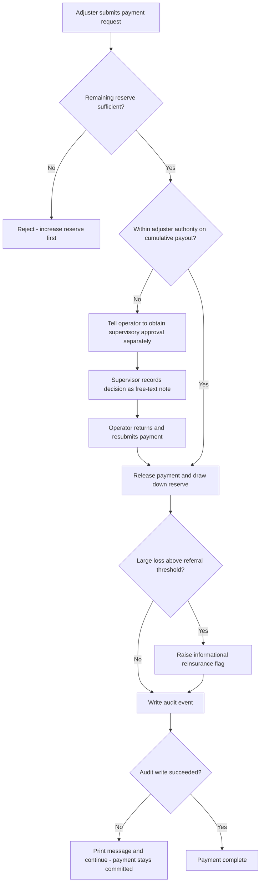
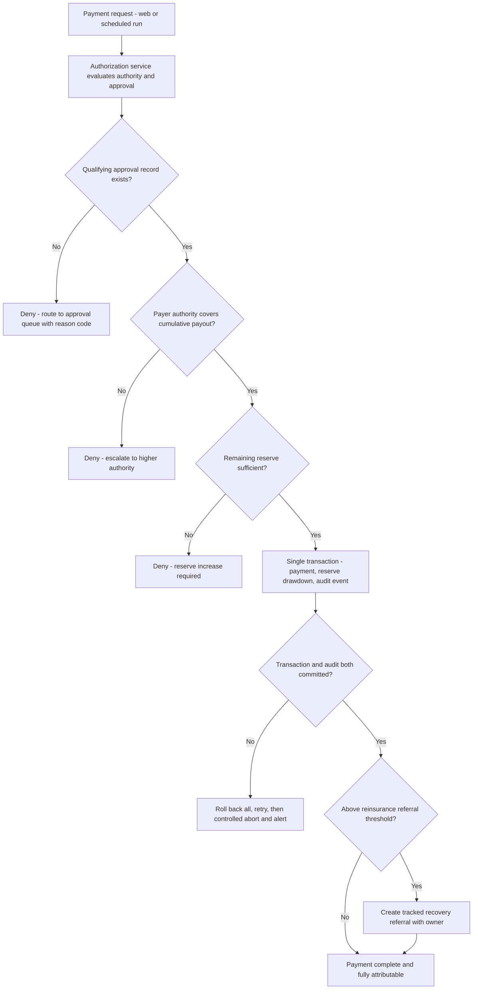
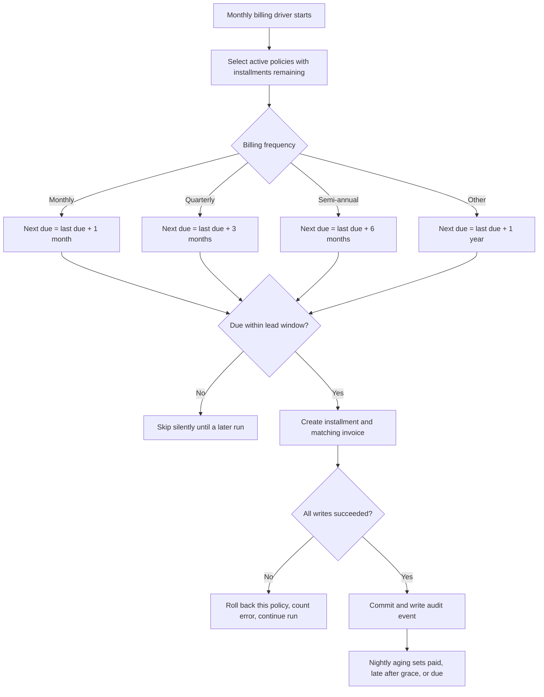
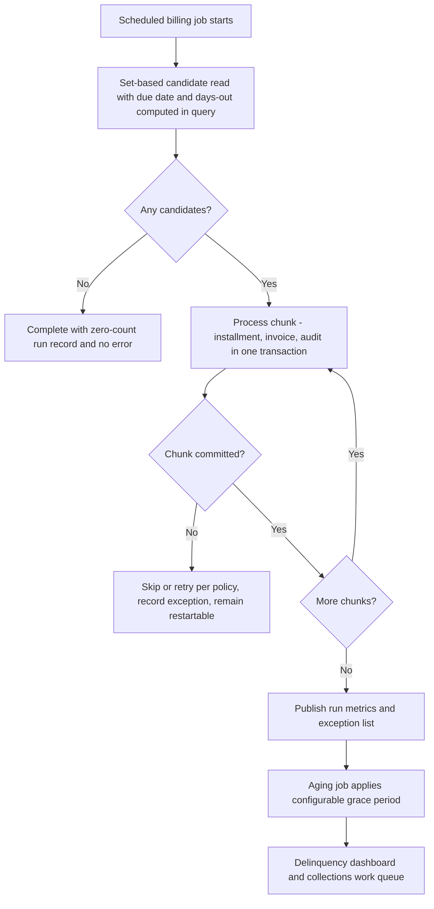
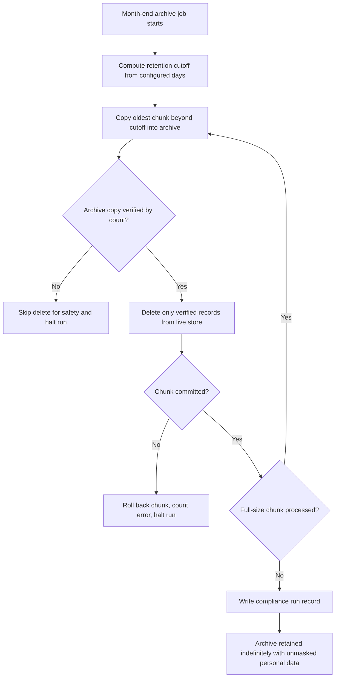
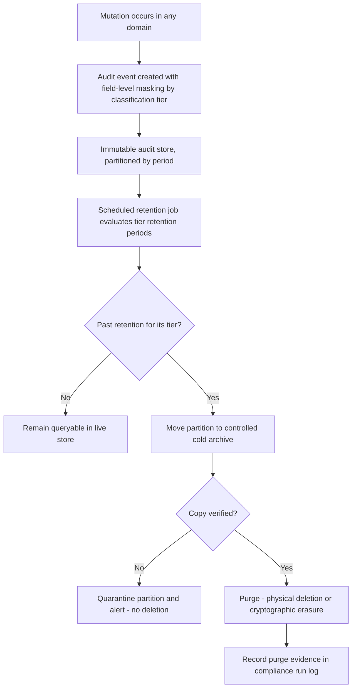
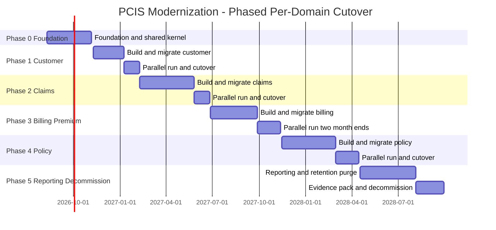

## Executive Summary

**Current state.** PCIS (Property & Casualty Insurance System) runs the company's entire insurance operation — customer master, agent management, quoting, underwriting, policy administration, premium rating, billing, payments, claims, reinsurance, documents, reporting, audit and security — as a single IBM i (AS/400) application written in fixed-format ILE COBOL with embedded static SQL against Db2 for i, driven by 5250 green-screen panels. The repository holds 39 members: 8 COBOL programs, 22 DDS display-file definitions, 2 IBM i Control Language members and 7 design documents describing 14 functional modules and a 55-table database. The status quo carries measurable cost: there is no automated test harness, no build pipeline, no container or infrastructure definition, and no API surface of any kind, so every change to money-moving logic — installment arithmetic, claim reserve drawdown, commission calculation, audit archiving — is verified only by human inspection. Two of the most trusted components in the architecture, the audit writer (AUDLOG01) and the authorization checker (SECCHK01), are referenced by name throughout the code and design documents but have no source member anywhere, so segregation of duties between claim approval and claim disbursement is a documented intention rather than an enforced control. Regulatory tunables such as the 365-day audit retention window, the 15-day billing lead time, the 10-day payment grace period and the $100,000 reinsurance referral threshold are compiled into program working storage and require a recompile and library promotion to change.

**Target state.** PCIS becomes a modular, API-driven Java platform: six domain services (Claims, Customer, Policy, Premium, Billing, Reporting) plus two shared kernel services (authorization and audit logging) built on Spring Boot, with the six nightly and monthly COBOL batch programs re-expressed as restartable Spring Batch jobs, the Db2 for i schema migrated to a cloud-hosted PostgreSQL model with exact decimal semantics preserved, and the 22 green-screen panels replaced by an accessible web experience that meets WCAG 2.1 AA. Every business behaviour evidenced in code or design documents is preserved to the cent; the audit, authorization and personal-data gaps identified in assessment are closed as part of the transformation rather than deferred.

**Who benefits.** Claims adjusters and supervisors gain enforced, auditable authority limits and off-terminal access; customer service representatives and agents gain a modern, accessible interface and self-service data; Finance and Actuarial gain a verifiable executable specification for premium, reserve and commission arithmetic; Compliance gains masked, classified, retention-bounded audit records; and IT gains a supported runtime with a repeatable build, restartable batch and a hiring pool that no longer depends on a shrinking COBOL skill base.

**Transition impact.** Migration proceeds one domain at a time with parallel running and cent-level reconciliation against the COBOL baseline before each cutover, so no financial mutation is disturbed and every phase has a rollback path. Db2 for i remains the system of record until a domain's parallel run passes its gate.

---

## Business Objectives and Success Criteria

| Objective | Current State (Before) | Target State (After) | Success Criteria | Measurement Method |
|---|---|---|---|---|
| **O1 — Make financial logic verifiable** | Installment arithmetic (annual premium ÷ installment count), claim reserve drawdown, commission rate application and the archive-verify-then-delete sequence are validated only by human code reading; zero automated tests exist. | Golden-output regression suite executes on every commit against a seeded database, asserting amounts, commit boundaries and record counts. | 100% of the 6 batch programs and both evidenced interactive transactions covered by golden-output tests; ≥90% line coverage on all monetary calculation code; 0 monetary defects escaping to parallel-run reconciliation per domain phase. | CI coverage report per build; count of reconciliation breaks logged per parallel-run cycle. |
| **O2 — Convert segregation of duties from convention to enforced control** | The claim payment batch declares only the audit writer in its CALLS list and performs no authority verification before inserting a disbursement; the approval-to-payment linkage is an unresolved open design item. | Authorization service evaluates adjuster authority limit before every claim payment write, in both interactive and batch paths, and records approver identity in the audit event. | 100% of claim-payment writes (interactive and batch) pass through a server-side authority check; 0 disbursements persisted without a matching approval record; deny-by-default enforced on 100% of financial mutation endpoints. | Automated authorization test suite; quarterly control test sampling 100 disbursements; endpoint security scan in CI. |
| **O3 — Bring personal data and audit retention under policy control** | Audit rows carry raw before/after values including customer tax ID, phone and email; live audit is trimmed at 365 days but the archive grows without any purge policy. | Field-level masking applied before audit persistence, every entity assigned a data classification tier, and a defined, configurable retention period per tier with automated purge. | 100% of 55 tables classified into Public / Internal / Confidential / Restricted; 0 unmasked restricted-tier values in audit or application logs (automated scan); automated purge job removes 100% of records past retention within 24 hours of expiry; audit retained ≥1 year minimum. | Automated log/audit scanner in CI and production; purge job run-log reconciliation; annual compliance audit evidence pack. |
| **O4 — Remove recompile-to-change regulatory tunables** | Retention days, chunk size, billing lead days, grace days, renewal window and reinsurance threshold are literals in working storage; batch actor identity is a hard-coded literal such as a fixed batch user name. | All tunables read from externalized configuration plus a versioned rules table with change history; batch identity derived from an authenticated workload principal. | 100% of the 6 identified tunables changeable without a code deployment; change of any tunable takes effect within 1 scheduled run with full who/what/when history; 0 hard-coded actor literals remaining in migrated code. | Configuration audit checklist per phase gate; code scan for numeric/actor literals; rules-table change log. |
| **O5 — Deliver an accessible, off-terminal user experience** | 22 fixed-position 24×80 panels reachable only from a terminal emulator; accessibility features structurally unavailable. | Responsive web interface over documented service contracts, usable on desktop and tablet, with keyboard and screen-reader support. | WCAG 2.1 AA conformance with 0 critical and 0 serious automated accessibility violations on 100% of migrated screens; task completion for the 8 highest-volume workflows at or below current keystroke-equivalent time within 30 days of each phase go-live. | Automated accessibility scan per build plus manual assistive-technology audit; timed task benchmarking with 10 users per role per phase. |
| **O6 — Make batch runs restartable and fit the nightly window** | Single-threaded cursor loops; a chunk or record failure sets an end-of-run switch and terminates with no restart point, and the archive job commits in blocks of 5,000 rows. | Chunk-oriented jobs with restart from last committed chunk, skip/retry policy, reduced blast radius and partitioned parallel steps for the highest-volume runs. | Every job restartable from the last committed chunk with 0 duplicate or orphaned financial records under fault injection; commit blast radius reduced from 5,000 rows to ≤1,000; each migrated job completes within its established batch window with ≥25% headroom. | Fault-injection test suite in CI; job execution metrics dashboard; batch window utilisation report. |
| **O7 — Establish a repeatable build and deployment path** | Compilation and promotion depend on two Control Language members and undocumented environment knowledge across the INSDEV → INSTST → INSPRD library chain; no pipeline, manifest, container or infrastructure definition exists. | Declarative multi-module build, versioned database migrations, automated pipeline with promotion gates mirroring DEV/TST/PRD, and a published runbook. | Build and deploy of any domain service reproducible in ≤30 minutes from a clean checkout by an engineer who has not built it before; 100% of schema changes applied through versioned migrations; 0 manual library-copy steps in the migrated deployment path. | Pipeline run duration metric; onboarding dry-run exercise per phase; migration history completeness check. |

---

## Personas and Stakeholders

Personas are inferred from module design documents, panel definitions and the role/authority model described in the architecture; the actual role-to-permission matrix could not be verified because the authorization component has no source member. [ASSUMPTION] User counts per role are not evidenced anywhere in the material and are therefore omitted rather than invented.

| Name | Type | Role | Goals | Pain Points | How Served |
|---|---|---|---|---|---|
| Claims Adjuster | Persona | Registers first notice of loss, maintains reserves and case notes, requests and issues payments within a personal authority limit | Open, adjust and settle claims quickly with a complete, defensible case file | Fixed 24×80 panels with no photo or document capture; must remember which function key routes to approval; authority rejection messages arrive only after re-entering the whole payment; no off-network access for field work | Web claim workspace with combined reserve, payment, note and document view; authority position shown before submission; document and photo attachment at intake; same capabilities available on tablet |
| Claims Supervisor | Persona | Approves or denies reserve levels and payment requests above an adjuster's authority; monitors reserve adequacy | Approve fast without losing the audit trail; be confident no payment bypassed approval | Approval is recorded as a note with no machine-readable link to the payment it authorises; no work queue exists, so approvals are found by asking; large-loss reinsurance signal is informational only | Approval decisions become first-class, linked records with an approval work queue; payment is blocked in code until a qualifying approval exists; reinsurance referral becomes a tracked outcome |
| Customer Service Representative | Persona | Creates and maintains customer master records, addresses and contact points; answers billing and policy questions | Onboard a customer once, correctly, and answer any question in one place | Duplicate tax-ID detection is a soft warning that is easy to click past; billing, policy and claim history live behind separate panels; validation errors surface as terse coded messages | Single customer view spanning policies, billing and claims; explicit duplicate-resolution step; plain-language, field-anchored validation messages |
| Policy Underwriter / Policy Administrator | Persona | Issues, endorses, renews and cancels policies; confirms coverage selections and premium | Issue an accurate policy with a defensible premium breakdown | Premium arrives as a single number from the rating service with no visible factor breakdown; renewal is a nightly batch outcome discovered the next morning; mandatory coverage rules enforced only inside the panel loop | Rating call returns a full factor, discount, surcharge and tax breakdown for disclosure; renewal outcomes and exceptions surfaced in a dashboard, not a job log |
| Insurance Agent / Producer | Persona | Sells and services policies; tracks commission on paid installments | See book of business and commission position without calling the office | No external access at all; commission position visible only after the monthly commission run; an agent with no active commission plan is silently skipped and only recorded in a run count | Agent portal over the same service contracts; commission exceptions raised as actionable items rather than a counter in a run log |
| Batch Operations / IT Operations | Stakeholder | Runs and monitors the nightly and monthly job drivers; recovers failed runs | Finish every run inside the window and know immediately when something breaks | A failed chunk ends the run with no restart point; failures signalled by console lines and counters; a failed audit write is printed and processing continues, leaving an unrecorded financial mutation | Restartable jobs with skip/retry policy, non-zero exit on error thresholds, structured logs and alerting on audit-write failure and window overrun |
| Compliance & Internal Audit | Stakeholder | Evidences audit completeness, retention, access control and segregation of duties | Produce evidence on demand and pass external examination | Audit records carry unmasked personal data; the archive grows indefinitely with no purge; authority enforcement cannot be demonstrated from source; tunable regulatory values change by recompile with no history | Masked, classified, retention-bounded immutable audit records with actor, resource and operation context; code-enforced authority checks with automated control tests; versioned change history for regulatory tunables |
| Finance & Actuarial | Stakeholder | Owns premium, reserve, commission and reinsurance-referral correctness | Trust that modernized arithmetic matches the legacy result to the cent | No executable specification exists for installment rounding, reserve drawdown or commission rounding, so any change is unverifiable | Golden-output regression suite becomes the signed-off specification; parallel-run reconciliation to the cent is the acceptance gate for each domain |
| Application Development Team | Stakeholder | Builds and maintains PCIS through the transition; keeps the legacy platform buildable and patched | Deliver the migration without breaking production or losing domain knowledge | Build and promotion steps are tribal knowledge; no tests to lean on; deep COBOL knowledge concentrated in a few people; risk of producing procedural Java that is a transliteration rather than a design | Paired COBOL-plus-Java delivery per domain, one thin end-to-end slice first, domain rules captured as executable tests, scripted builds for both toolchains during coexistence |

---

## User Stories and Acceptance Criteria

| ID | As a... | I want to... | So that... | Priority | Acceptance Criteria |
|---|---|---|---|---|---|
| US-001 | Claims Supervisor | have every claim disbursement blocked unless a qualifying approval exists and the payer's authority covers the cumulative payout | segregation of duties is enforced by the system rather than by procedure | P0 | **Given** an approved reserve where `APPROVED_AMT > PAID_TO_DATE` and no approval record linked to the payment, **When** the claim payment job or endpoint attempts to write `CLAIM_PAYMENT_T`, **Then** the write is rejected, a structured authorization-denied event is emitted with actor, resource and operation, and the reserve remains at status `AP`. **And Given** an approval record exists but `CLAIM_ADJUSTER_T.AUTHORITY_LIMIT` is less than `PAID_TO_DATE + payment amount`, **Then** the write is rejected with a distinct reason code. **And Given** both checks pass, **Then** `CLAIM_PAYMENT_T` is inserted with status `I`, `CLAIM_RESERVE_T` is updated to `PD` with `PAID_TO_DATE = APPROVED_AMT`, and the audit event records approver identity and the authority limit applied — all within one transaction. |
| US-002 | Finance Analyst | see modernized billing generation produce byte-identical installments and invoices to the COBOL baseline | I can sign off functional parity before cutover | P0 | **Given** a seeded policy population with billing frequencies `M`, `Q`, `S` and a value outside that set, **When** both the COBOL `BIL003B` job and the Spring Batch equivalent run against the same data and reference date, **Then** the generated `BILLING_SCHEDULE_T` and `INVOICE_T` rows match on installment number, due date, amount and status for 100% of rows. **And** next due date is computed as last due date plus 1 month / 3 months / 6 months / 1 year respectively. **And** an installment is generated only when the computed due date is within `WS-LEAD-DAYS` (15) days of the run date. **And** installment amount equals annual premium divided by installment count with identical rounding, asserted at `DECIMAL(9,2)` precision via `BigDecimal`. |
| US-003 | Batch Operations Engineer | restart a failed batch job from the last committed chunk | a late failure does not force a full rerun inside a fixed nightly window | P1 | **Given** the audit archive job is processing chunks and a simulated database failure occurs mid-chunk, **When** the job is restarted, **Then** processing resumes from the last committed chunk, no audit row exists that was deleted from the live table without a verified archive copy, and no row is archived twice. **And** the commit chunk size is externally configured at ≤1,000 rows (reduced from 5,000). **And** the job exits with a non-zero status and raises an alert when the error count exceeds its configured threshold, instead of ending silently. |
| US-004 | Compliance Officer | have personal data masked before it reaches any audit or log record, with a defined retention period per classification tier | the system satisfies masking, classification and automated-purge policy | P0 | **Given** a customer record change involving tax ID, email or phone, **When** the audit event is persisted, **Then** restricted-tier values are masked at field level (for example, tax ID rendered as last 4 characters only) and the unmasked value never appears in the audit store or application logs. **And Given** an audit record older than its configured retention period, **When** the retention job runs, **Then** the record is physically removed or cryptographically erased and the action is recorded in the run log. **And** every one of the 55 tables has an assigned classification tier held in configuration, and a build-time check fails if any table is unclassified. |
| US-005 | Claims Adjuster | register a first notice of loss and attach supporting documents in one accessible web workflow | intake is complete and defensible at the point of contact | P1 | **Given** an authenticated adjuster and a policy in force on the loss date, **When** the FNOL form is submitted with loss date, claim type, description and initial reserve, **Then** a claim is created with status `O`, an initial reserve history row is written with reason 'Initial FNOL reserve', the loss narrative is stored as the first case note, any attached document is indexed, and an audit event is written — all in one transaction. **And Given** the loss date falls outside every in-force period for that policy, **Then** submission is rejected with a field-anchored message and nothing is persisted. **And** the page reports 0 critical and 0 serious automated accessibility violations and is fully operable by keyboard. |
| US-006 | Actuarial Analyst | receive a full premium breakdown (risk score, base rate, factors, discounts, surcharges, taxes) from the rating service | rate disclosure and reserve adequacy reviews are self-service | P1 | **Given** a rating request for a property or vehicle risk, **When** the rating service responds, **Then** the payload contains composite risk score, risk tier, base rate, every applied factor, discount, surcharge and tax line, and the final premium. **And** the calculation snapshot is persisted for audit. **And Given** underwriting rules return Decline, **Then** no premium is produced and the caller receives an explicit underwriting-stop outcome rather than a zero premium. **And** the rating contract is versioned and covered by consumer-driven contract tests asserted by the Claims, Billing and Policy consumers. |
| US-007 | Customer Service Representative | be forced to resolve a duplicate tax ID explicitly before a customer is created | duplicate customer masters stop entering the book | P1 | **Given** a new customer whose tax ID matches an existing active customer, **When** the create request is submitted, **Then** the request is rejected with a duplicate-candidate response listing the matching customer identifiers, and creation succeeds only when an explicit override reason is supplied by a user holding the override permission. **And** the override, its reason and the actor are recorded in the audit trail. **And** at least one mailing address and one contact method are required for creation, per the customer validation rules. |
| US-008 | Platform Engineer | change a regulatory tunable without a code deployment | retention windows, lead times and thresholds track external timetables safely | P2 | **Given** the retention days, chunk size, billing lead days, grace days, renewal window and reinsurance referral threshold, **When** any value is changed in the versioned rules store by an authorized user, **Then** the next scheduled run uses the new value with no rebuild or redeploy, and the change history records old value, new value, actor and effective timestamp. **And** an invalid value (negative, non-numeric or outside its configured bounds) is rejected at write time, not at run time. |
| US-009 | Existing PCIS User (edge case — zero disruption) | continue my current workflow unchanged for any domain not yet migrated | the phased rollout never leaves me unable to do my job | P0 | **Given** a domain still running on the legacy platform, **When** a migrated domain writes data that the legacy domain reads, **Then** the legacy panel path continues to function with no behavioural change and Db2 for i remains the system of record for that domain. **And Given** a migrated domain fails its post-cutover health gate, **When** rollback is triggered, **Then** traffic returns to the legacy path within the defined rollback window and no financial record is lost or duplicated, verified by reconciliation counts and checksums. |
| US-010 | Batch Operations Engineer (edge case — audit write failure) | have a failed audit write stop the financial mutation rather than be logged and ignored | no financial change is ever persisted without its audit record | P0 | **Given** the audit service is unavailable, **When** a billing installment, commission posting, delinquency status change or claim payment is attempted, **Then** the mutation and its audit record either both commit or both roll back, the failure escalates through retry then controlled abort, and the error is never swallowed. **And** an alert is raised on the first audit-write failure. **And** a regression test asserts that the legacy behaviour of continuing after an audit failure is not reproduced. |
| US-011 | Compliance Officer (edge case — permission failure) | be denied by default anywhere a permission is unmapped | no unmapped path becomes an accidental privilege | P0 | **Given** a request to any financial-mutation operation for which the caller has no explicitly granted permission, **When** the request is evaluated, **Then** it is denied server-side, returns a structured 403 response with no internal detail or stack trace, and an authorization-denied audit event is recorded with actor, resource and operation. **And** a build-time check fails if any mutating operation lacks an explicit permission annotation. |
| US-012 | Reporting Analyst (edge case — empty data) | receive a well-formed empty result rather than an error when no rows qualify | reports and jobs are trustworthy on quiet days | P2 | **Given** a batch run or report where the candidate query returns zero rows, **When** the run completes, **Then** it exits successfully, writes a run-log row with zero selected and zero processed, emits no error-level log entry, and the report renders an explicit 'no qualifying records' state. **And** the run-log row is identical in shape to a non-empty run so that trend dashboards remain continuous. |
| US-013 | Policy Administrator | have policy renewal produce the next term, expire the prior term and record both history events atomically | renewal cannot leave a policy in a half-renewed state | P1 | **Given** an active policy whose expiration date is within the configured renewal window (currently 60 days), **When** renewal runs, **Then** premium is recalculated through the rating service, a new-term policy row is created with carried-forward coverages and deductibles, the prior term is set to expired, and both an expiry and a renewal history event are written — all in a single commit per policy. **And Given** the rating service returns a non-success code, **Then** the whole policy renewal rolls back, the error count increments, the policy remains active and unexpired, and the failure is reported with policy identifier and reason. |

---

## Business Process Overview

Three processes carry the highest financial and control risk and are therefore specified with both current-state and target-state flows. A fourth (policy renewal) is summarised for completeness.

### 5.1 Claim Approval and Payment Disbursement

**Business purpose.** When a loss is settled, the insurer must pay the correct amount to the correct payee, draw the reserve down by exactly that amount, and be able to prove that someone with sufficient authority approved it. This is the single highest-value control in the system: approval and disbursement are deliberately separate steps so that no one person can both authorise and release money.

**Trigger event.** An adjuster submits a payment request against an open claim (interactive), or the nightly payment run picks up reserves that have been marked approved but not yet disbursed (scheduled).

**Current-state flow, inputs and outputs.**
1. *Adjuster requests payment* — inputs: claim reference, payment type, amount, payee name. Outputs: none yet.
2. *Decision point — is the remaining reserve sufficient?* If the reserve minus amount already paid is less than the request, the operator is told to increase the reserve first; nothing is written.
3. *Decision point — is the request within the adjuster's personal authority, measured on cumulative claim payout?* If not, the operator is told to obtain supervisory approval first. The system does not route the request; it is the operator's responsibility to go and get approval.
4. *Supervisor records a decision* — inputs: decision code, written rationale. Output: a case note. **No machine-readable link is created between that approval and the payment it authorises.**
5. *Payment is released* — outputs: a payment record marked issued, an increased paid-to-date, a reserve drawdown history row, a payment note, and an audit event.
6. *Nightly payment run* — selects approved-but-unpaid reserves and disburses the full outstanding amount. **It performs no authority verification and has no link to the approval note.** Amounts above the configured referral threshold (currently $100,000) additionally raise an informational reinsurance recovery flag which does not block anything.
7. *Error/exception paths.* Any database failure rolls back that single claim, increments an error count and prints a console line; the run continues. A failed audit write is printed and the payment stays committed — leaving a financial mutation with no audit record.

**Participants.** Adjuster (request), Supervisor (approval), Batch Operations (nightly run), Reinsurance team (downstream recovery), Compliance (after-the-fact review).

**Business outcome.** Money moves and the reserve is drawn down, but the chain of authority is reconstructable only by reading free-text notes.

**Target-state flow.** Approval becomes a first-class, linked record with its own lifecycle. Authority is evaluated server-side by the shared authorization service on every payment path — interactive and batch alike — against the payer's authority limit and the cumulative payout, and the approving identity and limit applied are carried into the audit event. Reinsurance referral becomes a tracked outcome with an owner rather than an informational note. An audit-write failure fails the whole payment.

### 5.2 Installment Billing and Delinquency Aging

**Business purpose.** Active policies must be billed on their agreed frequency, invoices raised ahead of the due date, and unpaid installments aged into delinquency so that collections and cancellation processes can act. Under-billing loses revenue; over-billing creates refunds and complaints.

**Trigger event.** The monthly billing driver runs billing generation; the nightly driver runs delinquency aging.

**Current-state flow, inputs and outputs.**
1. *Select candidates* — inputs: active policies with a billing plan and an existing schedule whose highest installment number is below the plan's installment count. Output: a candidate list.
2. *Compute next due date* — decision point on billing frequency: monthly adds one month, quarterly three months, semi-annual six months, anything else defaults to one year.
3. *Decision point — is the due date within the lead window?* Only installments due within 15 days are generated; others are skipped silently until a later run.
4. *Create installment and invoice* — inputs: annual premium, installment count. Outputs: an installment row marked due with amount equal to annual premium divided by installment count, an invoice marked open for the same amount, and an audit event.
5. *Nightly aging* — inputs: installments already due or late with a due date on or before today. Decision points: fully paid becomes paid; unpaid beyond the 10-day grace period becomes late and increments a delinquency counter; otherwise it stays due. Output: an updated status plus an audit event of the old and new status.
6. *Error/exception paths.* Each policy or installment commits independently; a failure rolls that one item back, increments an error count and prints a line, and the run continues. A failed audit write is printed but the status change stays committed. A cursor-open failure ends the run before any work is done, recorded only as a console line and a zero-count run-log row.

**Participants.** Batch Operations, Billing team, Collections, Finance, Agents (commission depends on paid installments).

**Business outcome.** Installments and invoices exist for every policy that should be billed, and unpaid items are visibly aged.

**Target-state flow.** Candidate selection and date arithmetic move into a single set-based read instead of per-row round trips; generation runs as a restartable, partitionable job with a configurable lead window and grace period; skipped candidates and audit-write failures become visible exceptions rather than silent outcomes; and the installment and its audit record commit together.

### 5.3 Audit Retention, Archiving and Purge

**Business purpose.** Every data mutation across the insurer must leave an immutable record, retained long enough to satisfy examination but not indefinitely, and never exposing personal data in the clear. Today the retention half works and the purge and masking halves do not.

**Trigger event.** The month-end schedule entry runs the audit archiving job.

**Current-state flow, inputs and outputs.**
1. *Compute cutoff* — input: retention days (currently 365). Output: a cutoff timestamp.
2. *Copy a chunk to the archive* — up to 5,000 of the oldest records beyond the cutoff that are not already archived. Output: archived rows and a copied count.
3. *Decision point — verification.* The archive is counted; if the archive holds fewer matching records than were just copied, the delete is skipped for safety.
4. *Delete the same chunk from the live store* — only records confirmed present in the archive. Output: a deleted count.
5. *Decision point — commit or roll back.* On success the chunk commits and the loop continues until a short chunk indicates the end; on failure or verification mismatch the chunk rolls back and **the entire run halts**.
6. *Write a run record* — outputs: archived, deleted and error counts for compliance traceability.
7. *Error/exception paths.* A halted run leaves older records unarchived until the next month-end. There is no purge stage at all: the archive grows without bound, carrying unmasked before-and-after values including customer tax ID, phone and email.

**Participants.** Batch Operations, Compliance, Data Protection, Internal Audit.

**Business outcome.** The live audit store stays a fixed size; the archive becomes an unbounded, unmasked personal-data liability.

**Target-state flow.** Masking and classification are applied at the point the audit event is created, so no unmasked restricted value ever reaches the store. Retention becomes a metadata operation over partitioned data, followed by a genuine purge stage — physical deletion or cryptographic erasure — for records past their tier's retention period, with cold archive under write-once controls and lifecycle expiry. A verification failure quarantines the affected partition and alerts rather than silently halting the run.

### 5.4 Policy Renewal (summary)

**Business purpose.** Policies approaching expiry must be re-rated and rolled into a new term so coverage is continuous and premium reflects current rates. **Trigger:** nightly renewal driver selects active policies expiring within the configured window (currently 60 days). **Flow and decision points:** premium is recalculated through the shared rating service — a non-success response aborts that policy; a new term is created; coverages and deductibles are carried forward; the prior term is expired; and an expiry event plus a renewal event are recorded. Each policy commits independently, so one failure does not block the population. **Error path:** the whole policy rolls back, an error is counted and a console line printed. **Target state:** the same business sequence, with renewal exceptions surfaced in a dashboard, and the rating call made against a versioned contract covered by consumer-driven tests. **Outcome:** continuous coverage with a defensible re-rate and a complete event history.

---

## Business Rules and Policies

| Rule | When It Applies | User Experience | Example |
|---|---|---|---|
| **BR-01 Authority limits are evaluated on cumulative payout, not the single transaction** | Every claim payment, interactive or scheduled | The adjuster sees their remaining authority headroom before submitting; a request that would push the claim's total paid above their limit is refused with a clear escalation path. Exception: a documented supervisory approval linked to the payment permits it to proceed. | An adjuster with a $25,000 limit who has already paid $20,000 on a claim submits a further $10,000. Because $30,000 exceeds $25,000 the request is refused, even though $10,000 alone is within limit. This closes the loophole of splitting one large payment into several small ones. |
| **BR-02 Approval and disbursement must be performed by different controls** | Any claim payment above the requesting adjuster's authority | The payment screen never silently escalates; it directs the user to obtain approval, and the approval becomes a linked record that the payment step verifies. Exception: none — there is no override path that bypasses approval. | A $150,000 settlement is requested by an adjuster with a $25,000 limit. A supervisor with sufficient authority approves it with a written rationale; only then can the disbursement be released, and the audit record names both parties. |
| **BR-03 Reserve history is append-only** | Every reserve set, adjustment or drawdown | Users see a complete chronological reserve history; no screen or service allows an existing history row to be edited or removed. Exception: none. | An initial $10,000 reserve, an increase to $18,000 with reason 'engineer report received', and a $12,000 drawdown on payment appear as three separate rows. The actuarial team can reconstruct the reserve position on any past date. |
| **BR-04 A reserve may never be set below the amount already paid** | Reserve maintenance | The reserve field rejects a value lower than paid-to-date with a field-anchored message; the user must reduce nothing and instead explain the change. Exception: none. | A claim with $12,000 already paid cannot have its reserve reduced to $8,000; the request is refused and the reserve remains at its current level. |
| **BR-05 A claim cannot be paid unless it is open** | Claim payment | Closed claims are read-only for payment; the user is told a controlled reopen is required first. Exception: a reopened claim behaves as open. | A claim closed last quarter receives a late supplemental invoice. The adjuster must reopen the claim through the controlled status transition before any payment can be issued. |
| **BR-06 Installments are generated only inside the lead window** | Monthly billing generation | Policyholders receive invoices a predictable, configurable number of days before the due date rather than months in advance. Exception: none; candidates outside the window are re-evaluated on the next run and now appear on an exceptions list rather than disappearing silently. | With a 15-day lead window and a run on 10 August 2026, an installment due 20 August is generated; one due 20 September is not, and is picked up in the next cycle. |
| **BR-07 Installment amount is annual premium divided by installment count, at exact two-decimal money precision** | Every installment generated | The amount shown to the customer matches the amount billed to the cent; no floating-point drift is possible. Exception: none — rounding behaviour is fixed and asserted by regression tests. | A $1,200.00 annual premium on a 12-installment plan bills $100.00 per installment. Any change to this arithmetic fails the golden-output regression suite before it can be deployed. |
| **BR-08 Next due date depends on billing frequency, with an annual default** | Monthly billing generation | Customers on monthly, quarterly and semi-annual plans are billed on their agreed cadence; an unrecognised frequency defaults to annual rather than failing. Exception: the default is retained for parity but now raises a data-quality exception. | Monthly adds one month, quarterly three months, semi-annual six months; a policy carrying an unexpected frequency code is billed annually and flagged for correction. |
| **BR-09 Unpaid installments become delinquent only after the grace period** | Nightly aging | Customers are not marked late the day after the due date; the configured grace period applies before status changes and collections activity begins. Exception: an installment paid in full is marked paid regardless of timing. | With a 10-day grace period, an installment due 1 August is still 'due' on 9 August and becomes 'late' on 12 August, at which point it enters the delinquency count. |
| **BR-10 Commission is calculated only on paid installments and only once** | Monthly commission run | Agents are paid on cash received, not on billed amounts, and each installment is commissioned exactly once. Exception: an agent with no commission plan effective today is skipped and now raised as an actionable exception rather than a silent counter. | A $100.00 installment paid in July with a 10% plan rate yields $10.00 commission, the installment is marked commissioned, and it is never picked up by a later run. |
| **BR-11 A commission plan applies only within its effective dates** | Commission rate lookup | The rate in force on the calculation date is used; an expired plan is not applied. Exception: where no plan is in force, no commission is posted and an exception is raised for the agent-management team. | A plan effective 1 January 2026 with no expiry is used for a July 2026 calculation; a plan that expired in March 2026 is not. |
| **BR-12 Claim disbursements above the reinsurance referral threshold must be referred** | Claim payment disbursement | A large-loss payment automatically creates a pending recovery referral. Exception: today the referral is informational and does not block payment; that behaviour is preserved for parity but becomes a tracked item with an owner and due date. | A $150,000 disbursement against a $100,000 threshold creates a pending recovery referral for the reinsurance team; a $90,000 disbursement does not. |
| **BR-13 Audit records are never deleted from the live store without a verified archive copy** | Audit retention processing | Compliance can assert that no audit record was lost during retention processing; a verification failure stops deletion rather than risking loss. Exception: none. | The archive is counted before any deletion; if the count is short, deletion is skipped, the affected batch is quarantined and an alert is raised. |
| **BR-14 Every data mutation, authentication event and administrative action produces an immutable audit record retained at least one year** | All domains, all channels | Users cannot turn auditing off; a mutation whose audit record cannot be written does not complete. Exception: read-only inquiry produces no audit record, consistent with existing inquiry design. | A billing status change from 'due' to 'late' records the actor, the resource, the operation, the old value and the new value. If the audit service is unavailable, the status change is rolled back. — Organization Policy: *Audit Logging (SOC 2, SOX, HIPAA)* |
| **BR-15 Restricted personal data is masked before it reaches any audit record or log** | Any change involving tax ID, date of birth, email, phone or address | Users with a business need see full values in the application; audit records and operational logs show masked values only. Exception: an explicit, permission-gated and itself-audited unmask action for authorised investigators. | A tax-ID correction records the change as a masked before-and-after pair rather than two clear-text identifiers. — Organization Policy: *PII and Privacy Protection (GDPR, CCPA)* |
| **BR-16 Every data entity carries a classification tier with defined retention** | All 55 tables | Retention and access behaviour is predictable per tier and visible to compliance. Exception: none — an unclassified entity fails the build. | Customer tax ID is Restricted with the shortest retention consistent with statutory obligation; a coverage-type reference list is Internal. — Organization Policy: *Data Classification (GDPR, ISO 27001)* |
| **BR-17 Access is denied by default and enforced on the server** | Every operation across every domain | Users see only the actions their role grants; hiding a button is never the control. Exception: none. | A customer service representative attempting a claim disbursement is refused server-side and the attempt is audited, even if the action is reachable by URL. — Organization Policy: *A01 Broken Access Control* |
| **BR-18 Cardholder data is never stored or processed by PCIS** | Any premium payment capture | Customers pay through a tokenized third-party gateway; PCIS holds only a token and the last four digits for reconciliation and display. Exception: none — no primary account number, expiry or security code may enter any PCIS store, log or audit record. | A policyholder pays online; PCIS records the gateway token and 'ending 4321' against the installment. The system therefore remains outside PCI-DSS cardholder-data scope. |
| **BR-19 A customer requires at least one mailing address and one contact method** | Customer creation | Creation is refused until the customer is reachable for service and billing. Exception: none. | A commercial customer added with a tax ID but no address or phone is refused with two field-anchored messages. |
| **BR-20 A duplicate tax ID must be explicitly resolved before a customer is created** | Customer creation | The user is shown the matching customer and must either use it or record an override reason; a soft warning that can be clicked past is no longer sufficient. Exception: permission-gated override with recorded reason. | Adding a second customer with an existing tax ID returns the matching customer identifier; proceeding requires an override reason, which is audited. |
| **BR-21 Underwriting decline stops rating before any premium is produced** | Every rating request | The user receives an explicit decline with reasons, never a zero or partial premium. Exception: a refer outcome continues rating but flags the risk for review. | A property failing a hard-stop underwriting rule returns a decline with rule references; no premium and no policy is created. |
| **BR-22 Mandatory coverages cannot be deselected** | Policy issue and endorsement | Mandatory coverage lines are visibly locked; attempting to remove one blocks submission. Exception: none. | A homeowners policy cannot be issued without its mandatory dwelling coverage; the selection screen refuses to submit. |
| **BR-23 Policy renewal is atomic per policy** | Nightly renewal | A policy is either fully renewed — new term, coverages, expiry of the prior term and both history events — or entirely unchanged. Exception: none. | If re-rating fails for one policy, that policy stays active and unexpired and appears on the renewal exception list; all other policies renew normally. |
| **BR-24 Errors are never silently swallowed and internal detail is never exposed** | All domains | Users see actionable, plain-language messages; support sees structured errors with actor, resource, operation and correlation identifier. Exception: none. | A database failure during payment shows 'We could not complete this payment — reference ABC123' while the log carries the full structured context and no stack trace reaches the user. — Organization Policy: *A10 Mishandling of Exceptional Conditions* |
| **BR-25 Regulatory tunables change as reviewed data, not as code** | Retention days, chunk size, billing lead days, grace days, renewal window, reinsurance threshold | Authorised business users change values with an approval trail; no deployment is required and history shows what value applied when. Exception: values outside configured bounds are rejected at entry. | Shortening audit retention from 365 to 180 days becomes a reviewed configuration change effective on the next run, with the prior value preserved for audit. |

---

## Success Metrics and KPIs

Baselines marked [ASSUMPTION] could not be established from the provided material — production data volumes, current batch runtimes and window sizes are explicitly listed as missing inputs. Each is to be measured during Phase 0 before its target is contractually fixed.

### Primary metrics

| Metric | Target | Measurement Method | Timeline | Business Impact |
|---|---|---|---|---|
| Functional parity of migrated domains | 100% of reconciled records match the COBOL baseline to the cent (0 unexplained breaks) across a minimum 30-day parallel run per domain | Automated nightly reconciliation of amounts, counts and checksums between Db2 for i and PostgreSQL for that domain | Gate for every domain cutover, from Phase 1 (2027-02) onward | No customer is mis-billed and no claim is mis-paid as a result of the migration |
| Golden-output test coverage of financial logic | 100% of the 6 batch programs and both evidenced interactive transactions covered; ≥90% line coverage on monetary calculation code | Coverage report published on every CI build | Achieved by end of Phase 0 (2026-11-06) | Money-moving logic becomes changeable with confidence for the first time |
| Claim payments passing a server-side authority check | 100% of interactive and batch disbursements; 0 disbursements without a linked approval record | Automated authorization test suite plus quarterly control test of 100 sampled disbursements | Enforced from Claims cutover (Phase 2, 2027-06) | Converts the headline segregation-of-duties control from documented intent to enforced, testable fact |
| Unmasked restricted-tier values in audit or logs | 0 occurrences | Automated scanner over audit store and log pipeline, run on every build and daily in production | From Phase 0 for the shared audit service; per domain thereafter | Removes the largest personal-data exposure and satisfies masking policy |
| Entities with an assigned classification tier and retention period | 55 of 55 tables (100%); build fails on any unclassified entity | Classification manifest checked in CI | Complete by 2026-11-06 | Retention and access controls become provable per data category |

### Secondary metrics

| Metric | Target | Measurement Method | Timeline | Business Impact |
|---|---|---|---|---|
| Regulatory tunables changeable without deployment | 6 of 6 (retention days, chunk size, billing lead days, grace days, renewal window, reinsurance threshold) | Configuration audit at each phase gate | Phase 0 for batch tunables; per domain thereafter | Regulatory changes land in days rather than a release cycle |
| Batch restartability | 100% of migrated jobs restart from the last committed chunk with 0 duplicate or orphaned financial records under fault injection | Fault-injection suite in CI | From first migrated batch job (Phase 2) | A late failure no longer forces a full rerun inside a fixed window |
| Commit blast radius on the archive job | Reduced from 5,000 rows to ≤1,000 rows per commit | Configuration value plus job execution metrics | Phase 0 | Smaller failure impact on the only job that deletes data |
| Accessibility conformance | WCAG 2.1 AA with 0 critical and 0 serious automated violations on 100% of migrated screens | Automated accessibility scan per build plus manual assistive-technology audit per phase | Per domain from Phase 1 | Legal and inclusion obligations met; capability that green-screen panels cannot provide |
| Build and deploy reproducibility | Clean-checkout build and deploy of any domain service in ≤30 minutes by an engineer new to that service | Timed onboarding dry-run at each phase gate | Phase 0 | Removes tribal-knowledge dependency and unblocks all automated controls |
| Schema changes applied through versioned migrations | 100%; 0 manual library-copy steps in the migrated deployment path | Migration history completeness check in CI | Phase 0 | Environment drift becomes visible and reversible |
| Set-based batch data access | 0 per-row round trips remaining for date arithmetic and days-out calculation in migrated jobs | Code review checklist plus query count instrumentation per job run | Per migrated job | Removes a known throughput ceiling before volumes grow |
| Contract-tested shared interfaces | 100% of rating, authorization and audit interfaces covered by consumer-driven contract tests from all consuming domains | CI contract test results | From Phase 0 for kernel services; per domain thereafter | Interface drift on the highest-fan-in components fails the build instead of production |

### Guardrail metrics

| Metric | Target | Measurement Method | Timeline | Business Impact |
|---|---|---|---|---|
| Production error rate on migrated services | <1% of requests error over any rolling 24-hour window; breach triggers rollback evaluation | Service error-rate dashboard with alerting | From first cutover | Protects users from a degraded modernized path |
| Batch window utilisation | Every migrated job completes within its established window with ≥25% headroom [ASSUMPTION: current window durations to be measured in Phase 0] | Job duration metrics against the measured baseline | Per migrated job | Prevents a modernized job from overrunning into the business day |
| Audit-write failures tolerated silently | 0 — every audit-write failure rolls back its mutation and raises an alert | Alert count reconciled against mutation rollback count | From Phase 0 | Eliminates the current class of unrecorded financial mutations |
| Interactive response time regression | 95th-percentile response time for the 8 highest-volume workflows no worse than the measured green-screen baseline [ASSUMPTION: baseline to be captured in Phase 0] | Synthetic monitoring plus real-user metrics per workflow | Per domain from Phase 1 | Users must not trade accessibility for speed |
| Legacy platform patch currency during coexistence | 100% of the coexistence period on a vendor-supported compiler and operating-system level with outstanding fixes applied | Quarterly platform currency review | 2026-08 through final decommission | The system being replaced stays secure and buildable for parallel-run comparison |
| Rollbacks executed per phase | ≤1 per phase, each completed within its defined rollback window with 0 financial records lost or duplicated | Cutover incident record plus post-rollback reconciliation | Every phase | Proves the rollback path is real rather than theoretical |
| Known open design items resolved before the dependent domain cuts over | 12 of 12 closed by their owning phase gate; 0 carried past cutover | Open-item register reviewed at each gate | Through Phase 5 | Prevents unresolved legacy ambiguity from being encoded permanently into the new platform |

---

## Risks, Assumptions, Dependencies, and Constraints

### Risks

| Risk | Probability | Business Impact | Trigger Conditions | Mitigation | Owner |
|---|---|---|---|---|---|
| **R1 — Business continuity break during a domain cutover** | Medium | A failed cutover in Billing or Claims stops invoicing or claim payment, directly affecting cash collection and policyholder settlement, with regulatory and reputational exposure | Post-cutover error rate above 1% in 24 hours; reconciliation break in any financial record; batch window overrun | One domain at a time with a minimum 30-day parallel run and cent-level reconciliation as the go/no-go gate; documented rollback to the legacy path per phase with a rehearsed procedure; cutover scheduled outside month-end billing and renewal peaks | IT Operations lead with Business domain owner |
| **R2 — Business logic fidelity lost in the rewrite** | High | Wrong premiums, installments, reserves or commissions; customer remediation, restatement and regulatory findings | Any reconciliation break during parallel run; golden-output test failure on a monetary calculation | Build the golden-output regression suite against the live COBOL baseline *before* writing Java; explicitly encode the known quirks — the scratch reuse of an installment-number field as a days-out counter, the annual default for unrecognised billing frequencies, rounding on commission, full-outstanding-amount disbursement — as named test cases; reconcile on production-volume data | Finance & Actuarial with Application Development |
| **R3 — Data migration integrity loss re-hosting embedded static SQL and Db2-for-i specifics** | High | Silent precision loss or corruption in monetary or key columns, discovered only after cutover | Row-count or checksum mismatch on any migrated table; precision assertion failure; sequence collision on a business document key | Produce a full incompatibility inventory before estimating; mandate exact-precision numeric types for all monetary columns with `BigDecimal` in application code; keep business document keys sequence-generated fixed-length values rather than identity columns; automated row-count and checksum reconciliation on every table with defined rollback triggers | Data Engineering lead |
| **R4 — Segregation-of-duties gap persists because the approval-to-payment linkage is unresolved** | Medium | The system's headline control remains unenforceable; audit finding; potential unauthorised disbursement | Claims phase gate reached with the approval-to-payment linkage still an open design item | Close open item 8 (mechanical linkage between claim approval and payment authority) before Claims build begins, using the approval entity already present in the database design; make the linkage a mandatory automated control test in CI | Compliance & Internal Audit with Claims domain owner |
| **R5 — Feature parity gap for modules that exist only as design specifications** | High | Scope and estimates for the five design-only claims programs and the incomplete customer design document rest on documentation that may not match any shipped behaviour | Discovery during Claims or Customer build that production behaviour differs from the design document | Produce a repository manifest classifying every program as shipped, design-only or externally owned; per the agreed approach, fully specify these modules by extrapolating from the partial design documents plus standard P&C claims patterns, and validate each extrapolated rule with a business owner sign-off before build; treat every extrapolated rule as a named test case | Product Owner with Claims domain owner |
| **R6 — Shared kernel services cannot be reconstructed faithfully** | High | Authorization and audit behaviour is re-invented rather than reproduced; inconsistent enforcement across domains; audit gaps | No source recoverable for the audit writer or authorization checker; observed audit records that the reconstructed writer cannot reproduce | Reverse-specify both services from their call sites and from existing audit data before building; reconcile the reconstructed audit writer against a sample of historical audit records; publish a single versioned interface contract and enforce it by aspect on every mutating operation and batch writer | Application Development lead |
| **R7 — Interface contract drift between callers of the shared audit service** | Medium | Truncated or mis-typed audit values, producing incomplete audit records in the migrated platform | Two callers pass different field widths or action-code formats for the same parameter position | The evidence already shows drift: batch callers pass a 3-character action code with 30-character before/after values, while interactive callers pass a 1-character action code with 100-character values and a wider key field. Normalise to one versioned contract with explicit field lengths and value domains, enforce it with consumer-driven contract tests, and assert no truncation of any historical value during migration | Application Development lead |
| **R8 — Commit-boundary and rollback semantics not reproduced** | Medium | Partial billing runs, duplicate invoices, orphaned audit rows, or audit records deleted from the live store without a verified archive copy | Fault-injection test failure; duplicate or orphaned record found during parallel run | Map each legacy commit point to an explicit chunk boundary — one policy or installment per commit for billing, commission, delinquency, renewal and claim payment; a bounded chunk for archiving — and assert commit behaviour and restart-after-failure in tests before cutover | Application Development lead |
| **R9 — Personal-data footprint expands during migration** | Medium | Unmasked tax IDs, phones and emails copied into cloud storage, log aggregators and lower environments, creating a larger exposure than the closed partition | Any unmasked restricted value found by the automated scanner in a non-production environment or log pipeline | Define the field-level masking and classification contract before any data leaves the source platform; mask during extract and in the log pipeline; encrypt in transit and at rest; use only masked or synthetic data in development and test | Data Protection Officer with Data Engineering |
| **R10 — Dependency and platform upgrade cascade** | Medium | Introducing a large managed-framework dependency tree without automated vulnerability monitoring trades one risk class for another; a framework upgrade forces coordinated library and runtime updates across all six domains | A vulnerability advisory with no upgrade path; a framework major-version change during a phase | Pin exact versions with a shared dependency manifest; automated dependency and container scanning with software bill of materials per release; schedule framework upgrades between phases, never inside a cutover window | Platform Engineering lead |
| **R11 — Team capacity and skills while running two platforms** | High | Schedule slip; procedural transliteration rather than domain-oriented design; knowledge loss as COBOL expertise retires | Missed phase gate; code review rejecting transliterated logic; key-person unavailability | Pair COBOL domain experts with Java engineers per domain; deliver one thin end-to-end slice (Customer) before scaling out; capture domain rules as executable tests during that slice; enforce a review rule rejecting transliterated procedural code; script both toolchains so the legacy baseline stays buildable | Application Development lead with Engineering Manager |
| **R12 — Unresolved legacy open design items get encoded permanently** | Medium | Ambiguities such as adjuster auto-assignment, late-reporting thresholds, cancellation reason domains, void billing status and the payee master become arbitrary new-platform behaviour | A phase gate reached with any owning open item still unresolved | Track all 12 published open design items in a register with an owning phase and a business decision-maker; make closure a gate condition; where a decision cannot be made, make the behaviour configuration-driven rather than hard-coded | Product Owner |
| **R13 — Extraction from the source platform proves harder than planned** | Medium | Cutover design changes late; longer parallel-run windows; higher reconciliation cost | Change-capture proves impractical on the source platform, forcing polling-based extraction | Validate the extraction approach on real volumes during Phase 0; design cutover assuming polling-based extraction with idempotent loads and reconciliation, treating true change capture as an optimisation rather than a dependency | Data Engineering lead |

### Assumptions

| Assumption | Impact if Wrong | Validation Plan |
|---|---|---|
| [ASSUMPTION] The five design-only claims programs and the incomplete customer design document accurately reflect the behaviour of the production objects | Scope, estimates and control assertions for the two highest-value domains are wrong; rework in Phases 1 and 2 | Recover the production objects, produce a repository manifest classifying every program as shipped, design-only or externally owned, and re-baseline scope before Phase 1 exit |
| [ASSUMPTION] The published design documents are the authoritative source of business rules where no code exists | Extrapolated rules diverge from actual behaviour; parity reconciliation fails | Business-owner sign-off on every extrapolated rule, each captured as a named test case, before the owning domain's build begins |
| [ASSUMPTION] Current batch windows, production data volumes and interactive response baselines can be measured in Phase 0 | Performance targets are unanchored and cutover gates cannot be objectively evaluated | Instrument the legacy platform during Phase 0 and publish measured baselines as the fixed reference for all performance gates |
| [ASSUMPTION] Personas and role definitions inferred from design documents and panel definitions match the real authorization matrix | Permission model is wrong at launch; users are over- or under-privileged | Extract the live role, user-role and role-to-menu authorization data and reconcile against the inferred model during Phase 0 |
| [ASSUMPTION] The reinsurance referral threshold stays informational rather than becoming a mandatory stop, per the current published design | Claims payment behaviour changes and reconciliation against the legacy baseline fails | Confirm with the Reinsurance business owner as part of closing the related open design item before Claims build |
| [ASSUMPTION] Payment capture can be fully delegated to a tokenized third-party gateway so no cardholder data enters PCIS | PCI-DSS scope re-enters the programme, adding significant compliance cost and design constraints to Billing and Payments | Confirm the gateway contract and integration pattern, and add an automated check asserting no cardholder-data field exists in any migrated schema, log or audit record |
| [ASSUMPTION] The audit archive can be masked retrospectively or retained under controlled access during migration | Either a large historical personal-data liability moves to the cloud, or historical audit is lost | Legal and Data Protection decision in Phase 0 on retrospective masking versus controlled retention versus documented destruction |
| [ASSUMPTION] Business document keys can retain sequence-generated fixed-length values on the target database | Key formats change, breaking cross-domain references and every downstream extract | Prove the sequence and format behaviour on the target database during Phase 0 with a round-trip test on a representative table |

### Dependencies

| System/Team | Dependency | Timeline | Impact if Delayed |
|---|---|---|---|
| Identity provider / Security team | Federated authentication and a validated role-to-permission mapping for the authorization service | Required before Phase 0 exit (2026-11-06) | The shared kernel cannot be completed; no domain can enforce deny-by-default, blocking every subsequent phase |
| Cloud platform / Infrastructure team | Target environments, managed PostgreSQL, container orchestration, secrets management and observability backend defined as code | Provisioned during Phase 0 | Domain builds have nowhere to deploy and no repeatable pipeline; all phases slip |
| Legacy IBM i platform team | Source platform kept on a supported compiler and operating-system level, buildable and patched throughout coexistence | 2026-08 through final decommission | Parallel-run comparison becomes impossible and the system being replaced becomes a security exposure |
| Finance & Actuarial | Sign-off on golden-output expectations for premium, installment, reserve, commission and refund arithmetic | Phase 0, then per domain gate | No acceptance criterion exists for functional parity; cutovers cannot be approved |
| Compliance, Internal Audit & Data Protection | Approved data classification and retention matrix for all 55 entities, and masking rules per field | Phase 0 (classification) and before each domain's data migration | Data migration cannot proceed without breaching classification and retention policy |
| Reinsurance team | Decision on informational referral versus mandatory stop threshold, and ownership of recovery referrals | Before Claims build (Phase 2) | Claims payment behaviour is undefined; the related open design item blocks the Claims gate |
| Payments gateway provider | Tokenized capture integration, token and last-four storage contract, reconciliation file format | Before Billing/Payments build (Phase 3) | PCI scope risk returns and payment capture cannot be migrated |
| Document storage and notification services | Document storage integration contract, and the event distribution mechanism for notifications currently marked future in the architecture | Phase 4/5 boundary | Claim intake attachments and customer notifications remain on the legacy path longer than planned |
| Business domain owners (Customer, Claims, Billing, Policy, Reporting) | Availability for user acceptance testing, parallel-run reconciliation review and go/no-go decisions | Every phase gate | Cutovers cannot be approved; parallel-run periods extend, increasing cost and dual-running risk |

### Constraints

| Constraint | Type | Impact |
|---|---|---|
| Embedded static SQL is precompiled and bound; the target database has no static-bind equivalent, so every embedded statement must be re-hosted rather than re-pointed | technical | Application refactoring, not schema conversion, is the dominant effort and the dominant source of risk |
| Exact decimal precision must be preserved for all monetary values, matching the existing packed-decimal host variables | technical | Mandates exact-precision numeric types and decimal arithmetic in application code; forbids floating-point money |
| Business document keys must remain sequence-generated fixed-length values, not identity columns | technical | Constrains the target schema design and the migration approach for every keyed table |
| The source database must remain the system of record until a domain passes its parallel-run gate, and existing batch schedules and audit semantics must be preserved | business | Requires coexistence, replication or dual-write, and reconciliation tooling for the full transition |
| Financial mutations — billing, claim payment, commission, audit archiving — must not be disturbed | business | Cutovers must avoid month-end billing and renewal peaks and must have a rehearsed rollback |
| Deny-by-default access control on all financial mutations, immutable audit with at least one year retention, per-entity classification and automated purge, and no silent error swallowing | regulatory | Non-negotiable design inputs for every service from day one; retrofitting is not acceptable |
| Interfaces must meet WCAG 2.1 AA | regulatory | Rules out any screen-scraping or terminal-emulation end state as the final user experience |
| Payment capture must remain outside PCI-DSS cardholder-data scope via tokenization | regulatory | No cardholder data may enter any PCIS store, log or audit record |
| Insurance record-keeping obligations extend well beyond the current 365-day live audit window | regulatory | Retention design must support multi-year tiered retention with controlled archive, not a single window |
| The library and environment topology of the source platform must be respected during transition, with only the production data library holding real customer data | technical | Constrains parallel-run data flows and mandates masked or synthetic data in all lower environments |
| Migration proceeds one domain at a time with parallel running; no big-bang cutover | business | Extends the overall timeline and requires funding for a sustained dual-platform operating period |
| No test harness, build pipeline, container definition, infrastructure-as-code or service interface exists today | technical | Foundation work is a hard prerequisite for every other item; nothing else can be verified until it lands |

---

## Scope, NFRs, and Open Questions

### In Scope

- Claims management: first notice of loss, claim maintenance and reserve adjustment, supervisory approval, payment disbursement (interactive and scheduled), claim inquiry, and reinsurance recovery referral
- Customer management: customer master creation and maintenance, addresses, contact points, search, inquiry and controlled deletion
- Policy administration: policy issue with coverage and deductible selection, endorsement, renewal, cancellation and inquiry, with full policy event history
- Premium calculation: the shared rating capability including risk scoring, underwriting rule evaluation, base rate and factor lookup, discounts, surcharges, taxes, and a persisted calculation snapshot for rate disclosure
- Billing: installment schedule generation, invoice raising, billing plan maintenance, delinquency aging and billing inquiry
- Commission calculation on paid installments with agent commission plan and rate resolution
- Reporting: operational, regulatory and management reporting and extracts, moved off the transactional data path
- Shared kernel: an authorization service enforcing deny-by-default and adjuster authority limits, and an audit service producing masked, classified, immutable records
- Audit retention: archiving, tiered retention and a genuine automated purge stage
- An accessible web experience replacing the 22 green-screen panels for all migrated domains
- Externalized configuration and a versioned rules store for regulatory tunables
- Golden-output regression harness, build and deployment automation, versioned database migrations, and structured logging with metrics and alerting
- Data migration of the 55-entity model to the target database with row-count and checksum reconciliation

### Unchanged During Transition (no rework required)

- Business rules and calculation outcomes: premium, installment, reserve, commission and refund arithmetic produce identical results; parity is the acceptance gate
- Data model semantics: entity relationships, business document key formats, monetary precision and the standard created-by/updated-by audit columns
- Batch cadence: the nightly, monthly and month-end schedule pattern and the ordering relationships between renewal, billing, commission, delinquency, claim payment and audit archiving
- Commit granularity as a business behaviour: one policy, installment or claim payment per committed unit, so a single failure never blocks the remaining population
- Segregation of duties as a design principle: approval and disbursement remain distinct steps — the change is that it becomes enforced rather than procedural
- Append-only reserve history and read-only inquiry semantics (inquiry produces no audit record)
- The source database remains the system of record for any domain not yet cut over

### Out of Scope for Modernization (staying as-is permanently)

- Modules with no evidenced implementation in this repository — agent management beyond commission calculation, quote management, underwriting decisioning, payments beyond premium capture and application, reinsurance treaty and cession administration, document management internals, and security administration screens — remain on their current path; only their integration contracts with the six migrated domains are in scope
- Cardholder data handling: never brought into PCIS; capture stays delegated to a tokenized third-party gateway
- Legacy-style physical file equivalents retained in the design for compatibility are not carried into the target schema
- The default annual billing frequency for unrecognised frequency codes is preserved for parity rather than corrected, but is surfaced as a data-quality exception

### Out of Scope for This Phase (deferred)

- Event distribution and near-real-time notification: the notification interface is marked future in the current architecture and is deferred to a later phase
- Mobile field-adjuster application: the service contracts are designed to support it, but no mobile client is delivered in these phases
- Agent and policyholder self-service portals
- Analytics warehouse and self-service business intelligence beyond the reporting separation delivered in the final phase
- Rules-engine adoption for underwriting: explicit domain services are used unless the rules prove genuinely volatile
- Formal payee and vendor master for tax reporting, which remains an open design item
- Retrospective masking of the existing audit archive, pending a legal and data-protection decision

### Non-Functional Requirements

- **Performance.** Interactive operations: 95th-percentile response time no worse than the measured green-screen baseline for the 8 highest-volume workflows [ASSUMPTION: baseline captured in Phase 0]. Batch: each migrated job completes within its established window with at least 25% headroom; date arithmetic and days-out calculation performed set-based in the candidate query rather than per row; sequence values allocated in blocks; commit chunk size externally configured at 1,000 rows or fewer for the archiving job.
- **Security.** Federated authentication with token validation; deny-by-default authorization enforced server-side on every operation, with a build-time check failing any mutating operation that lacks an explicit permission; adjuster authority limits evaluated on cumulative payout before every claim disbursement; parameterized queries and allow-list input validation on all external input; credentials held in a managed secret store with rotation and never in images, configuration files or source; workload identity replacing the current hard-coded batch actor literals; restricted data encrypted in transit and at rest; structured error responses that never leak stack traces or internal detail.
- **Accessibility.** WCAG 2.1 AA across all migrated screens, with 0 critical and 0 serious automated violations, full keyboard operability, screen-reader support, and a manual assistive-technology audit per phase.
- **Scalability.** Independent scaling of interactive and batch workloads; horizontal scaling for interactive services and on-demand capacity for month-end billing, renewal and commission peaks; partitionable parallel steps for the highest-volume jobs; connection pooling sized for combined interactive and batch load; audit data partitioned by period so retention cutoff is a metadata operation rather than a large delete. [ASSUMPTION: growth projections not supplied — capacity model to be built on the Phase 0 volume baseline.]
- **Compliance.** Immutable audit records for every data mutation, authentication event and administrative action, carrying actor, timestamp, resource and change detail, retained at least one year and per-tier thereafter; all 55 entities classified into Public, Internal, Confidential or Restricted with defined handling and retention; automated purge by physical deletion or cryptographic erasure; personal data masked in audit and logs, anonymised in non-production and encrypted in storage; support for data-subject access, rectification, erasure and portability; no cardholder data in scope; consistent interface naming, versioning and response formats with correct status codes and structured, actionable error responses; single-responsibility modules with dependency injection so business logic is testable without infrastructure mocks; strict typing with explicit null handling.
- **Reliability and observability.** Every migrated job restartable from its last committed chunk with skip and retry policies, non-zero exit on error thresholds, and no duplicate or orphaned financial records under fault injection; structured logs carrying job identifier, service, actor, resource and operation; metrics, traces, dashboards and alerts on billing runtime, installment counts, audit-write failures, authorization denials and archive verification.

### Open Questions

1. Can the production objects for the claim payment batch, the commission batch, the five design-only claims programs and the missing customer design content be recovered, and if not, does the business accept extrapolated specifications as authoritative? — *Application Development lead and Product Owner*
2. What is the exact mechanical linkage between claim approval and claim payment authority, given that an approval entity already exists in the database design but the design document leaves the linkage open? — *Claims business owner with Compliance*
3. What are the production data volumes, current batch window durations and interactive response baselines? — *IBM i platform team and IT Operations*
4. What is the live role, user-role and role-to-menu authorization matrix, and how many users hold each role? — *Security team with each domain owner*
5. What retention period applies to each data classification tier, given insurance record-keeping obligations extend well beyond the current 365-day live window? — *Compliance and Legal with Data Protection*
6. Should the existing audit archive be retrospectively masked, retained under controlled access, or destroyed under a documented policy? — *Data Protection Officer with Legal*
7. Does the reinsurance referral threshold remain informational, or become a mandatory stop before disbursement? — *Reinsurance business owner*
8. Which target cloud provider, database version and region, and what is the acceptable cutover downtime window per domain? — *Infrastructure lead with IT Operations*
9. What is the exact compiler and operating-system level on the source platform, and is it on a vendor-supported level for the whole coexistence period? — *IBM i platform team*
10. Which adjuster auto-assignment algorithm is authoritative — round-robin, workload-balanced or territory-based — since the design document leaves it as a build-phase decision? — *Claims business owner*
11. What are the authoritative reference-data domains for cancellation reasons, claim types and the proposed void billing status? — *Product Owner with each domain owner*
12. Which payment gateway is selected, and does its token and last-four contract satisfy reconciliation and display needs without any cardholder data reaching PCIS? — *Finance with Security team*
13. Is funding approved for a sustained dual-platform operating period across all five migration phases? — *Project sponsor*

---

## Rollout Plan

Migration follows a phased per-domain cutover with parallel running, as agreed: one domain at a time, each with its own reconciliation gate and rollback path. The source database remains the system of record for every domain that has not passed its gate. No cutover is scheduled inside a month-end billing, commission or renewal peak.

**Phase 0 — Foundation Hardening and Shared Kernel**
*Timeline: 2026-08-10 → 2026-11-06 (13 weeks)*
- **Description.** Build the engineering foundation that every later phase depends on, without changing any business behaviour. Nothing functional cuts over in this phase.
- **Key milestones and deliverables.** Repository manifest classifying every program as shipped, design-only or externally owned. Measured baselines for data volumes, batch window durations and interactive response times. Golden-output regression harness covering all 6 batch programs and both evidenced interactive transactions, signed off by Finance and Actuarial. Authorization and audit services rebuilt as first-class components with a single versioned interface contract, reconciled against historical audit records and normalising the parameter-width drift found between batch and interactive callers. Data classification and retention matrix for all 55 entities, with field-level masking rules. Externalized configuration and versioned rules store for the 6 identified tunables. Declarative multi-module build, versioned database migrations, automated pipeline with DEV/TST/PRD promotion gates, containerisation, infrastructure as code, secrets management, structured logging with metrics and alerting, and a published runbook. Scripted build for the legacy toolchain so the baseline stays buildable. Target environments and managed database provisioned. Extraction approach validated on real volumes.
- **Dependencies.** Identity provider and role matrix from the Security team; cloud environments from Infrastructure; Finance and Actuarial availability for golden-output sign-off; Compliance and Legal for classification and retention decisions; open design items 8, 11 and the classification questions closed or explicitly deferred with a configuration-driven fallback.
- **Success gates (go/no-go).** Golden-output suite green with ≥90% coverage on monetary calculation code; audit service reproduces a sample of historical audit records with no value truncation; deny-by-default proven by automated test with a build-time check on unannotated mutating operations; all 55 entities classified; all 6 tunables changeable without deployment; clean-checkout build and deploy in ≤30 minutes by an engineer new to the service; measured baselines published.
- **Rollback.** Not applicable — no production behaviour changes. Foundation work is additive and reversible.
- **Owner.** Application Development lead with Platform Engineering.

**Phase 1 — Customer Domain (thin end-to-end pilot)**
*Timeline: 2026-11-09 → 2027-02-05 (13 weeks, including a 30-day parallel run)*
- **Description.** Prove the whole approach end to end on the lowest-financial-risk domain: customer master, addresses, contact points, search and inquiry, delivered as a service plus accessible web experience. This is the pattern all later domains copy.
- **Key milestones and deliverables.** Customer service and accessible web screens; explicit duplicate tax-ID resolution replacing the current soft warning; masked audit events for every customer mutation; customer data migrated with row-count and checksum reconciliation; personal-data masking proven in the extract and log pipeline; contract tests published for downstream consumers.
- **Dependencies.** Phase 0 complete; recovered or business-approved customer design content; Data Protection sign-off on masking; Customer business owner for user acceptance testing.
- **Success gates.** 30 consecutive days of parallel running with 100% record match and 0 unexplained reconciliation breaks; 0 critical and 0 serious accessibility violations; error rate below 1% over a rolling 24 hours; 0 unmasked restricted values found by the automated scanner; user acceptance sign-off from the Customer business owner; response time no worse than the measured baseline for the highest-volume customer workflows.
- **Rollback triggers and gate.** Reconciliation break in customer master data, error rate above 1% in 24 hours, or any unmasked restricted value in a log or audit record. Rollback returns all customer traffic to the legacy panels within the agreed window; the legacy path remains warm for the full parallel-run period plus 30 days.
- **Owner.** Customer domain owner with Application Development.

**Phase 2 — Claims Domain**
*Timeline: 2027-02-08 → 2027-06-25 (20 weeks, including a 30-day parallel run)*
- **Description.** Migrate the highest-control-value domain: first notice of loss, claim maintenance and reserve adjustment, supervisory approval, payment disbursement (interactive and scheduled), inquiry, and reinsurance referral. The five design-only claims programs are fully specified by extrapolating from the published design document plus standard P&C claims patterns, with every extrapolated rule signed off by the business and captured as a named test case.
- **Key milestones and deliverables.** Claims services and accessible web workspace; approval becomes a first-class linked record with a supervisor work queue; server-side authority verification on cumulative payout enforced on both interactive and scheduled disbursement paths; claim payment batch converted to a restartable job with one payment per committed unit; append-only reserve history preserved; reinsurance referral becomes a tracked item with an owner; document attachment at intake; claims data migrated and reconciled.
- **Dependencies.** Phase 1 gate passed; open design items on approval-to-payment linkage, adjuster auto-assignment, late-reporting threshold and reinsurance referral resolved; Reinsurance team decision on informational versus mandatory threshold; Compliance sign-off on the enforced control design; document storage integration contract.
- **Success gates.** 30 consecutive days of parallel running with claim payments, reserve balances and audit events matching the baseline to the cent; 100% of disbursements demonstrably passing an authority check with a linked approval, evidenced by a control test of 100 sampled payments; fault-injection test showing restart with 0 duplicate or orphaned payments; 0 critical and 0 serious accessibility violations; error rate below 1%; Claims and Compliance sign-off.
- **Rollback triggers and gate.** Any monetary reconciliation break, any disbursement without a linked approval, any duplicate payment under restart, or error rate above 1% in 24 hours. Rollback returns claims traffic and the nightly payment run to the legacy path; parallel run resumes before a second attempt.
- **Owner.** Claims domain owner with Compliance and Application Development.

**Phase 3 — Billing, Premium and Commission**
*Timeline: 2027-06-28 → 2027-11-12 (20 weeks, including a 45-day parallel run spanning two full month-end cycles)*
- **Description.** Migrate the recurring revenue engine: installment schedule generation, invoice raising, billing plan maintenance, delinquency aging, commission calculation, and the shared rating capability including risk scoring, underwriting rule evaluation, discounts, surcharges and taxes.
- **Key milestones and deliverables.** Billing, Premium and commission services with a versioned rating contract and consumer-driven contract tests asserted by Claims, Billing and Policy; set-based candidate selection replacing per-row round trips; configurable lead window and grace period; full premium breakdown returned for rate disclosure; tokenized payment capture integration with token and last-four storage only; skipped candidates and commission exceptions surfaced as actionable items; billing and rating data migrated and reconciled.
- **Dependencies.** Phase 2 gate passed; payment gateway contract in place; Finance sign-off on installment, commission and rounding golden outputs; open design items on the void billing status and the payee master resolved or made configuration-driven.
- **Success gates.** 45 consecutive days of parallel running across two month-end cycles with 100% match on installment amounts, due dates, invoice totals, delinquency status transitions and commission amounts; 0 cardholder-data fields present in any migrated schema, log or audit record (automated check); each migrated job inside its measured window with at least 25% headroom; contract tests green from all consuming domains; Finance and Billing sign-off.
- **Rollback triggers and gate.** Any installment, invoice or commission amount mismatch; any duplicate invoice under restart; any cardholder-data field detected; batch window overrun. Rollback returns billing generation, aging and commission runs to the legacy schedule; a full month-end cycle must complete cleanly in parallel before a second attempt.
- **Owner.** Billing domain owner with Finance and Application Development.

**Phase 4 — Policy Administration**
*Timeline: 2027-11-15 → 2028-04-14 (22 weeks, including a 45-day parallel run)*
- **Description.** Migrate the largest and most central domain: policy issue with coverage and deductible selection, endorsement, renewal, cancellation, inquiry and full event history. Policy is the highest-fan-in entity in the system, so it moves only after its consumers have proven contracts.
- **Key milestones and deliverables.** Policy service and accessible web screens; the multi-record policy issue transaction preserved atomically; renewal converted to a restartable job with atomic per-policy commit and a renewal exceptions dashboard; mandatory coverage enforcement moved into the domain service; policy event history preserved; policy data migrated with key-format and precision reconciliation; versioned published read contracts for all consuming domains.
- **Dependencies.** Phase 3 gate passed; rating contract stable; open design items on the renewal window parameter, pro-rata cancellation refund formula, cancellation reason domain and the premium-change referral threshold resolved with Finance and Actuarial sign-off.
- **Success gates.** 45 consecutive days of parallel running with 100% match on issued policies, premiums, coverage and deductible lines, renewal outcomes, expiry transitions and event history; business document key formats unchanged; renewal job restartable with 0 half-renewed policies under fault injection; 0 critical and 0 serious accessibility violations; error rate below 1%; Policy and Actuarial sign-off.
- **Rollback triggers and gate.** Any premium or coverage mismatch; any half-renewed policy; any key-format deviation; error rate above 1% in 24 hours. Rollback returns policy maintenance and the nightly renewal run to the legacy path.
- **Owner.** Policy domain owner with Actuarial and Application Development.

**Phase 5 — Reporting, Audit Retention and Legacy Decommission**
*Timeline: 2028-04-17 → 2028-09-29 (24 weeks)*
- **Description.** Move reporting off the transactional data path, complete the audit retention and purge capability end to end, and retire the migrated portions of the legacy platform.
- **Key milestones and deliverables.** Reporting separated onto read replicas or a reporting schema with defined views and modern report delivery replacing spooled output; audit archiving converted to a partition-based retention operation with a genuine purge stage, controlled cold archive and purge evidence in the compliance run log; final reconciliation and evidence pack for Compliance; legacy panels, batch drivers and objects for all five migrated domains decommissioned; the source database retired as system of record for migrated domains; integration contracts confirmed for the modules remaining on the legacy path.
- **Dependencies.** Phases 1 to 4 all passed; Compliance and Legal decision on retrospective masking or controlled retention of the historical audit archive; sponsor approval to decommission.
- **Success gates.** Reporting queries no longer execute against transactional tables; automated purge removes 100% of records past retention within 24 hours of expiry with recorded evidence; a complete compliance evidence pack accepted by Internal Audit; 30 days of stable operation across all migrated domains with error rate below 1%; all 12 published open design items closed; formal sponsor approval before any legacy object is deleted.
- **Rollback triggers and gate.** Any compliance evidence gap, any purge acting on records inside retention, or reporting-driven contention appearing on the transactional path. Decommission is strictly one-way and is executed only after the sponsor gate; the legacy environment is preserved read-only for a defined evidence-retention period rather than deleted at cutover.
- **Owner.** IT Operations lead with Compliance and the project sponsor.

