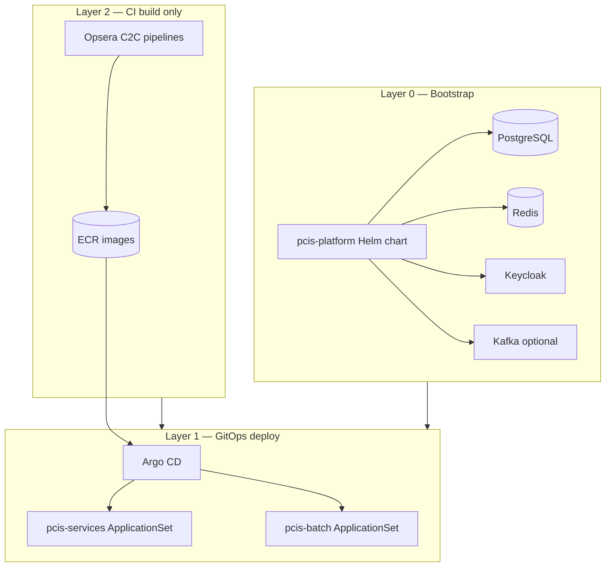

# PCIS cloud deployment — layered bootstrap + GitOps

This guide describes the **recommended way to deploy all PCIS services** to EKS dev,
replacing fifteen separate Opsera C2C deploy pipelines with a clear layering model.

## Problem with one pipeline per service

The current `pcis-api-gateway-dev-pipeline` (clone → build → push → helm deploy) works
for a single service but does not scale well:

| Issue | Why it hurts |
|-------|----------------|
| Platform deps missing | Pods crash-loop until Postgres/Redis/Keycloak exist |
| 15× deploy stages | Duplicate kubeconfig/helm logic, hard to order |
| Image vs manifest drift | Helm values in git diverge from pipeline `--set image.tag` |
| No deploy ordering | api-gateway before authz/policy backends = broken routes |

## Recommended architecture



### Layer 0 — Platform bootstrap (`helm/charts/pcis-platform`)

One-time (or Argo CD sync-wave **0**) install per namespace:

- **PostgreSQL** — service `postgresql`, all domain databases pre-created
- **Redis** — service `redis`
- **Keycloak** — service `keycloak`, realm imported from `infra/keycloak/realm-export.json`
- **Kafka** (dev) — Redpanda single-node as `kafka` for `reporting-svc`

```bash
# Manual install (Opsera bootstrap pipeline or local kubectl)
./helm/bootstrap/install-dev-platform.sh
```

Or apply Argo CD app: `argocd/applications/pcis-platform-dev.yaml`

### Layer 1 — GitOps deploy (Argo CD) — **preferred for all services**

Use existing ApplicationSets:

| Resource | Sync wave | Scope |
|----------|-----------|--------|
| `argocd/applications/pcis-platform-dev.yaml` | 0 | Platform |
| `argocd/applicationsets/pcis-services.yaml` | 1 | 9 microservices × env |
| `argocd/applicationsets/pcis-batch.yaml` | 2 | CronJobs |

Argo CD watches `main` and applies Helm charts with `values-dev.yaml`. **Do not**
run `helm upgrade` per service from C2C once Argo CD is enabled — let GitOps own manifests.

Deploy order inside sync-wave 1 (optional fine-grained waves via chart annotations):

1. `authz-svc`, `config-svc` (when chart exists)
2. Domain: `customer-svc`, `policy-svc`, `claims-svc`, `billing-svc`, `premium-svc`, `audit-svc`, `reporting-svc`
3. Edge: `api-gateway` (last — needs backends up)

### Layer 2 — CI build & push (Opsera C2C) — **images only**

Split CI from CD:

| Pipeline | Stages | Frequency |
|----------|--------|-----------|
| `pcis-platform-dev` | clone → helm deploy bootstrap | Once / on platform changes |
| `pcis-build-matrix-dev` | clone → docker build (changed services) → ECR push | Every merge to main |
| ~~per-service deploy~~ | **Remove** — Argo CD deploys from git | — |

**Image tag flow (pick one):**

1. **GitOps tags (recommended):** C2C pipeline commits updated `image.tag` in `values-dev.yaml` → Argo CD auto-syncs
2. **Immutable digest:** Use Argo CD Image Updater or Renovate to track ECR `:main-<sha>` tags
3. **Single monorepo tag:** All services share `global.image.tag` in a shared values file

## Opsera pipeline layout

### A. Bootstrap pipeline (new)

```
Name: pcis-platform-dev-pipeline
Stages: clone → deploy-platform
Deploy script: ./helm/bootstrap/install-dev-platform.sh
Cluster: opsera-usw2-np / namespace pcis-dev
Run: once before first service deploy, re-run on platform chart changes
```

### B. Build matrix (replace 15 deploy pipelines)

One pipeline with a service matrix (or path-filtered builds):

```
clone → detect-changed-services → parallel docker build → ECR push → (optional) git tag bump
```

Keep the existing `pcis-api-gateway-dev-pipeline` for build/push only — **remove the
helm deploy stage** once Argo CD is active, or gate deploy behind `DEPLOY_VIA_ARGOCD=true`.

### C. Production path

| Environment | Platform | Services | Sync |
|-------------|----------|----------|------|
| dev | In-cluster `pcis-platform` | Argo CD automated | Self-heal |
| tst | Aurora/ElastiCache via ESO | Argo CD manual | Approval |
| prd | Terraform `infra/` modules | Argo CD manual + gate | Change ticket |

Terraform modules under `infra/modules/` provision **managed AWS** deps for tst/prd.
Update `values-prd.yaml` to use External Secrets Operator — not in-cluster Postgres.

## Quick start (dev EKS)

```bash
# 1. Bootstrap platform
./helm/bootstrap/install-dev-platform.sh

# 2. Register Argo CD apps (if not already)
kubectl apply -f argocd/applications/pcis-platform-dev.yaml
kubectl apply -f argocd/applicationsets/

# 3. Build & push images (Opsera C2C or local)
docker build -f services/api-gateway/Dockerfile -t <ecr>/opsera/pcis-api-gateway:main .
docker push <ecr>/opsera/pcis-api-gateway:main

# 4. Update image tag in helm/charts/api-gateway/values-dev.yaml and merge to main
#    Argo CD syncs automatically

# 5. Verify
kubectl get pods -n pcis-dev
curl -k https://pcis-api-gateway-dev.agent.opsera.dev/actuator/health
```

## Files added for bootstrap

| Path | Purpose |
|------|---------|
| `helm/charts/pcis-platform/` | Platform Helm chart |
| `helm/bootstrap/install-dev-platform.sh` | Install script for C2C / manual |
| `argocd/applications/pcis-platform-dev.yaml` | Argo CD sync-wave 0 |
| `ops/bootstrap/deploy-order.yaml` | Machine-readable deploy layers |

## Still TODO

- Helm charts for `config-svc`, `sync-agent`
- C2C build-matrix pipeline in Opsera (replace per-service deploy)
- Re-run `pcis-api-gateway-dev-pipeline` after bootstrap is healthy
- tst/prd: wire `values-prd.yaml` to Terraform outputs + ESO
